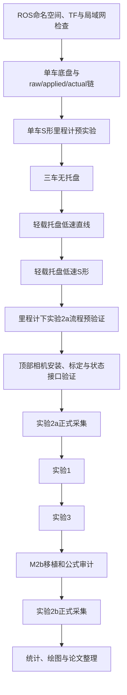

# 三移动机器人协同搬运实物实验设计与实施安排（v1.2.1 接口冻结版）

> 适用论文题目：**鲁棒裕度感知动态协同边界下多移动机器人协同搬运分层约束抗扰控制**  
> 对应实验体系：实验1、实验2a、实验2b、实验3及可选补充验证  
> 现有平台：三台运行 ROS1 的差速 AGV、轻载刚性托盘、car1 中央计算机、car2/car3 车载计算机、现有 STM32 底盘控制固件、轮速反馈、IMU、里程计及后期顶部视觉定位  
> 对应理论版本：**控制方法章节 v3.7、公式证明 v3.6、仿真实验设计 v6.0**  
> 文件用途：用于现有 AGV_ROS 平台改造、控制软件分层、通信接口统一、实物实验实施、数据记录、统计分析、论文图表生成和结论边界审查。

---

## 相对 v1.2 的接口冻结修订

本版保留 v1.2 已确认的理论、实验和平台适配结论，仅修正实现前仍存在的接口歧义，并将原“建议接口”冻结为首轮开发基线：

1. 修正实施流程中“实验2a正式采集早于顶部相机”的顺序矛盾，统一为里程计流程预验证、顶部相机标定、实验2a正式采集。
2. 将全部消息示例改为合法 ROS1 `.msg` 语法；`CooperativeState` 增加三车逐车有效标志、逐车测量时间和逐车定位来源。
3. 冻结 ROS 层车轮速度为轮缘线速度，单位统一为 `m/s`；串口层继续使用现有 `mm/s`，理论轮角速度由轮半径换算得到。
4. 将车端限幅顺序冻结为“目标速度限幅—非对称加减速度斜坡—最终速度安全限幅”，并明确反向命令必须先减速到零再反向加速。
5. 冻结每条 TF 的唯一发布者，禁止顶部相机和里程计同时发布同一 TF 边。
6. 结合现有代码冻结首轮频率：车端串口与限幅执行 250 Hz、车端状态与能力发布 100 Hz、中央下层与二维跟踪 100 Hz、中央上层 25 Hz。
7. 新增正式话题表、消息字段、单位、时间戳、队列和非锁存规则，作为后续代码实施与测试的唯一接口依据。

---

## 相对 v1.1 的修改说明

1. 将三车算法通信主链路由自定义 UDP 改为 ROS1 局域网通信，car1 同时作为中央上位机、ROS Master 和机器人1执行计算机；现有 UDP 仅保留为 VOFA 调试或监视接口。
2. 明确区分“算法层分布式图结构”和“工程层集中计算部署”：论文中的无向连通图、邻接矩阵、钉扎矩阵和领导者信息结构保持不变，car1 在一个中央程序内为三个虚拟智能体计算原分布式耦合项。
3. 将三车所有节点、话题和 TF 分别放入 `/agv1`、`/agv2`、`/agv3` 命名空间，禁止共用全局 `cmd_vel`、`odom`、`base_link`、`scan` 等名称。
4. 重构 `chassis_controller` 职责：移除多车状态订阅、`SwarmData`、其他车辆状态保存和预留协同算法线程；车端仅执行本车物理限幅、差速换算、串口通信、轮速/IMU/里程计反馈和能力报告。
5. 将论文中的“下层自适应抗扰约束跟踪控制器”部署在 car1 的 `multi_agv_control` 中；车端 `chassis_controller` 仅作为控制输出后的物理执行与安全约束层，二者不再混用。
6. 机器人2软件降额改由 car2 的 ROS `chassis_controller` 真正执行，暂不修改 STM32 固件。car1 的 `experiment_supervisor` 根据机器人2实际路径推进位置下发 `DeratingCommand`，car2 以预注册平滑斜坡调整左右轮最大速度、最大加速度和最大减速度。
7. 建立“谁执行限制，谁报告能力”的能力数据链。car2 执行限幅的同一模块发布 `CapabilityReport`；car1 的 `capability_mapper` 再将原始车端能力映射为路径通道能力和公共能力上界。
8. 暂不扩展 STM32 通信协议。左右电机电流、直流母线电流、STM32 时间戳、驱动器状态字和故障标志从当前强制项降为后续增强项；本轮不评价真实能耗、电流负担或温升。
9. 在 ROS 层建立 `raw command → applied command → actual wheel speed` 三层数据链，同时记录现有 `packet_seq`、串口帧 ROS 接收时间、能力报告、降额状态、IMU、里程计和电池电压。
10. 独立通信看门狗暂缓实施。当前保留时间戳、序列号、报告年龄和网络延迟用于离线审计，但不宣称已实现自动通信超时停车。
11. 新增统一 `CooperativeState` 状态接口，使中央算法与具体相机、雷达、里程计驱动解耦；定位层仍提供真实状态反馈，状态估计层负责坐标统一、路径投影和速度估计。
12. 定位采用两阶段方案：前期使用三车轮速+IMU里程计完成预实验；后期使用覆盖完整 S 形路径的顶部相机及机器人/托盘视觉标记完成正式高精度实验。
13. S 形路径统一由 car1 的 `path_generator` 生成并弧长参数化；由唯一公共载荷推进量生成托盘和三支撑点参考，禁止三车独立生成二维 S 形参考。
14. 公共载荷推进速度继续按理论由候选速度与公共内层区间投影获得；定位系统只提供实际状态，不直接生成参考速度。
15. 软件分层统一为 `pose_provider`、`path_state_estimator`、`upper_reference_generator`、`lower_channel_controller`、`planar_support_tracker`、三车 `chassis_controller`、`experiment_supervisor` 和 `data_logger`。
16. 实验室实施顺序固定为“实验2a → 实验1 → 实验3 → 实验2b”；论文中的实验定义、M1/M2a/M2b/M4 和 R1–R4 定义不变。
17. 正式主要指标删除电流负担、真实能量、温升和 STM32 内部故障，强化托盘位姿、支撑点、路径推进误差、能力边界、能力衔接裕度、轮速需求超限、实际限幅比例和任务时间。
18. 更新 ROS 包、消息、配置文件和版本冻结要求，新增 `agv_msgs`、`multi_agv_control`、`multi_agv_bringup` 等建议结构。

---

## 当前实现 / 后续增强清单

### A. 当前阶段必须实现

| 类别 | 必须实现内容 | 完成判据 |
|---|---|---|
| ROS 网络 | car1 作为 ROS Master；car2、car3 通过局域网接入 | 三车节点可稳定发现并通信，话题延迟可记录 |
| 命名空间 | `/agv1`、`/agv2`、`/agv3` 独立话题与 TF | 无重名 `cmd_vel/odom/base_link/imu`，TF 树无冲突 |
| 中央控制 | car1 集中运行上层、公共参考、下层、二维跟踪、状态估计、实验管理和记录 | 三虚拟智能体状态与耦合项可在线计算 |
| 车端执行 | 每车 `chassis_controller` 仅执行本车差速换算、轮速/加减速度限幅、串口下发和反馈 | 不再保存其他车辆状态，不再运行协同算法线程 |
| 软件降额 | car2 车端真实执行机器人2平滑降额 | `DeratingCommand`、实际限幅参数、`CapabilityReport` 一致 |
| 能力链 | 原始车端能力报告 + car1 路径通道能力映射 | 原始能力与映射能力均可记录和复算 |
| 三层命令链 | raw、applied、actual 轮速完整记录 | 可区分中央需求超限、车端限幅和底层跟踪误差 |
| 前期定位 | 三车轮速+IMU里程计、固定初始工装、world 对齐、里程计复位 | 可完成单车、三车无托盘、低速托盘预实验 |
| 路径接口 | car1 弧长参数化 S 形路径及导数/曲率接口 | 非退化条件通过，三支撑点参考由统一载荷推进量生成 |
| 安全 | 人工急停、低速运行、物理隔离区、固定中止条件和现场监护 | 急停有效，现场安全流程冻结 |
| 数据与版本 | rosbag、配置、Git提交号、现有STM32固件版本、视频和处理脚本保存 | 任一实验可完整复现和审计 |

### B. 后期正式实验必须增加

| 类别 | 后期实现内容 | 用途 |
|---|---|---|
| 顶部视觉定位 | 覆盖完整 S 形路径的顶部相机；三车和托盘独立视觉标记 | 正式高精度绝对位姿、支撑点误差和托盘位姿评价 |
| 视觉标定 | 相机内外参、world 坐标系、标记到机体/托盘刚体变换 | 统一几何真值 |
| 因果融合 | 视觉帧间允许里程计短时预测；原始与因果滤波位姿同时记录 | 提高实时控制连续性并保留可审计原始数据 |
| 正式重复 | 每种主方法原则上8次配对有效重复 | 统计均值、标准差、中位数和四分位距 |

### C. 当前暂不实施，仅作后续增强

| 暂不实施项 | 当前处理方式 |
|---|---|
| STM32 协议新增电流、总线电流、内部状态字和故障标志 | 不修改固件，不作为本轮冻结条件 |
| STM32 本地时间戳 | 使用车端收到串口帧时的 ROS 时间戳 |
| 独立通信看门狗和自动超时停车 | 保留接口与日志字段，当前不宣称已经实现 |
| 真实电能、电流负担和温升对比 | 本轮不作为主要指标；电池电压仅辅助记录 |
| 驱动器内部故障诊断 | 不评价、不宣称 |
| 未知高滚阻能力在线估计 | 可作为后续补充，不影响主软件降额实验 |
| 接触力、内部力、防滑和抗倾覆测量 | 需要额外力学模型和传感器，当前不推断 |

---

# 0. 总体定位、实验目标与理论边界

实物实验不改变论文核心理论，也不重新定义实验目的。四组实验仍回答：

$$
\boxed{
\begin{aligned}
\text{实验1}&:\ \text{本文完整分层闭环能否在真实平台连续运行并形成理论—二维执行链；}\\
\text{实验2a}&:\ \text{在相同下层和物理接口下，能力反馈与动态协同边界是否具有独立贡献；}\\
\text{实验2b}&:\ \text{本文完整方法与英文文献完整分层约束方法在局部能力退化下的综合差异；}\\
\text{实验3}&:\ \text{在相同上层公共参考下，参数自适应与扰动补偿的独立贡献。}
\end{aligned}
}
$$

实验2主工程链条保持为：

$$
\boxed{
\text{机器人2车端可用能力下降}
\Rightarrow
\text{车端原始能力报告}
\Rightarrow
\text{中央路径通道能力映射}
\Rightarrow
\rho_2\downarrow
\Rightarrow
\beta_2^{\mathrm{risk}}\uparrow
\Rightarrow
\overline v_2^\sigma\downarrow
\Rightarrow
\overline v_L^\sigma\downarrow
\Rightarrow
\upsilon_L^{\mathrm{ref}}\downarrow.
}
$$

必须坚持：

1. M1、M2a、M2b、M4 和 R1–R4 的数学定义不变。
2. 实验2a的 M1 与 M2a 共享候选参考发生器、本文下层控制器、二维执行器、车端物理限幅、退化曲线、路径、初始条件和终点逻辑；唯一核心差异仍是动态边界与能力反馈是否进入上层。
3. 实验2b是两种完整方法对比，M1–M2b 的差异不能全部归因于动态边界。
4. 车端物理限幅器不是论文下层自适应抗扰约束跟踪控制器。
5. 若实物仅实现公共速度、二维支撑点跟踪和车端限幅，只能称为“上层动态边界与二维协同执行接口验证”。只有完整实现并记录 $x_{i,1}$、$x_{i,2}$、$u_i$、非线性映射、自适应参数和扰动估计后，才可称为完整下层实物实现。
6. 动态边界正不变性不自动推出任意时变硬件能力可行性。实物仍需报告：

$$
m_{\mathrm{link}}(t)
=
\overline v_{\mathrm{act}}^{\mathrm{pub}}(s_L^{\mathrm{act}},t)
-
\overline v_L^\sigma(t),
$$

$$
\boxed{
m_{\mathrm{link}}^{\mathrm{res}}(t)
=
m_{\mathrm{link}}(t)-\Delta v_{\mathrm{link}}.
}
$$

7. 持续输入或轮速限幅轨迹不直接由原无饱和 UUB 定理覆盖；饱和应作为实验指标报告。
8. 二维支撑点误差、托盘位姿误差和刚体残差属于工程评价量，不构成托盘接触动力学、内部力、防滑或抗倾覆证明。

## 0.1 统一符号

| 含义 | 统一符号或字段 |
|---|---|
| 支撑点路径速度比例 | $g_i(s)$ |
| 支撑点路径角速度比例 | $h_i^{\mathrm{geo}}(s)$ |
| 机器人二维角速度 | $\omega_i^{2D}$ |
| 风险因子 | $\beta_i^{\mathrm{risk}}$ |
| M2b 固定下/上速度界 | $\alpha^{\mathrm{lit}},\beta^{\mathrm{lit}}$ |
| M2b 分式增益参数 | $h_i^{\mathrm{lit}}$ |
| M2b 映射附加项 | $\zeta_i^{\mathrm{map}}$ |
| 车轮角速度上限 | $\omega_{w,i}^{\max}$ |
| 车轮角加速度上限 | $\alpha_{w,i,+}^{\max}$ |
| 车轮角减速度上限 | $\alpha_{w,i,-}^{\max}$ |
| 路径通道可用加/减速度 | $a_{i,+}^{\mathrm{ava}},a_{i,-}^{\mathrm{ava}}$ |
| 能力报告时间戳 | $t_i^{\mathrm{cap}}$ |
| 能力报告序列号 | $\mathrm{seq}_i^{\mathrm{cap}}$ |
| 能力报告年龄 | $\tau_i^{\mathrm{age}}=t-t_i^{\mathrm{cap}}$ |
| 中央原始轮速需求 | $\omega_{L/R,i}^{\mathrm{raw}}$ |
| 车端限幅后下发轮速 | $\omega_{L/R,i}^{\mathrm{applied}}$ |
| STM32 反馈实际轮速 | $\omega_{L/R,i}^{\mathrm{actual}}$ |

## 0.2 ROS接口单位冻结

现有 STM32 协议接收和反馈的是轮缘线速度 `mm/s`，不是直接可用的车轮角速度。为减少重复换算和单位误用，首轮接口统一采用 SI 制：

| 量 | ROS字段单位 | 串口单位 | 理论使用方式 |
|---|---|---|---|
| 车体线速度 | `m/s` | 按现有协议换算 | 直接使用 |
| 车体角速度 | `rad/s` | 由差速换算 | 直接使用 |
| 左右轮轮缘线速度 | `m/s` | `mm/s` | $\omega_{w}=v_w/r_w$ 换为轮角速度 |
| 左右轮轮缘线加/减速度 | `m/s^2` | 车端按实际 `dt` 转成每周期增量 | $\alpha_w=a_w/r_w$ 换为轮角加速度 |
| 位姿位置 | `m` | 不适用 | world坐标 |
| 航向角 | `rad` | 不适用 | 逆时针为正 |
| 路径推进量 | `m` | 不适用 | 弧长参数 $s$ |
| 时间戳 | ROS `time` | STM32无本地时间戳 | ROS主机同步时钟 |

消息字段使用 `wheel_linear_velocity` 和 `wheel_linear_acceleration` 明示物理量。论文图表若继续使用 $\omega_{w,i}$，必须由记录的轮缘线速度和冻结轮半径离线换算，并保存换算版本。禁止将 `mm/s` 数值直接写入标注为 `m/s` 或 `rad/s` 的字段。

---

# 1. 总体计算、通信与 ROS 部署架构

## 1.1 物理主机角色

- **car1**：中央上位机、ROS Master、机器人1车载计算机；集中运行三机器人论文算法、状态估计、实验管理和数据记录。
- **car2**：机器人2车载计算机；只运行 `/agv2/chassis_controller`、串口节点、IMU/里程计发布、降额执行和能力报告。
- **car3**：机器人3车载计算机；只运行 `/agv3/chassis_controller`、串口节点、IMU/里程计发布和能力报告。
- **STM32**：沿用现有固件，接收车端限幅后的左右轮命令并返回现有轮速、IMU相关反馈或现有底盘反馈帧。

```mermaid
flowchart LR
    CAM[前期里程计或后期顶部相机] --> PP[car1 / pose_provider]
    PP --> PSE[car1 / path_state_estimator]
    PSE --> CS[CooperativeState]
    CS --> URG[upper_reference_generator]
    CAP1[/agv1/capability_report] --> CM[capability_mapper]
    CAP2[/agv2/capability_report] --> CM
    CAP3[/agv3/capability_report] --> CM
    CM --> URG
    URG --> LCC[lower_channel_controller]
    LCC --> PST[planar_support_tracker]
    PST --> C1[/agv1/chassis_controller]
    PST --> C2[/agv2/chassis_controller]
    PST --> C3[/agv3/chassis_controller]
    ES[experiment_supervisor] --> URG
    ES --> C2
    C1 --> FB1[wheel/imu/odom/capability]
    C2 --> FB2[wheel/imu/odom/capability]
    C3 --> FB3[wheel/imu/odom/capability]
    FB1 --> PP
    FB2 --> PP
    FB3 --> PP
    DL[data_logger] --- CS
    DL --- URG
    DL --- LCC
    DL --- C1
    DL --- C2
    DL --- C3
```

## 1.2 ROS1 主链路与 UDP 定位

1. 三车控制与状态通信主链路使用 ROS1 话题、服务和参数服务器。
2. 自定义 UDP 不再承担算法状态交换、协同耦合或控制命令下发。
3. 现有 UDP 仅保留给 VOFA、示波显示或调试监视，不得作为正式实验唯一数据源。
4. 正式实验期间不启动 `move_base` 生成速度命令；若导航栈用于地图显示或传感器驱动，其速度输出必须断开，避免与论文控制器争用底盘控制权。

## 1.3 算法拓扑与计算部署的区别

论文上层仍采用原领导者—跟随者图结构：

$$
H=L+B.
$$

无向连通图、邻接矩阵 $A=[a_{ij}]$、拉普拉斯矩阵 $L$、钉扎矩阵 $B$ 和领导者可达条件不变。car1 在一个中央控制进程内维护三个虚拟智能体状态，并按原公式分别计算：

$$
\zeta_{z,i}
=
\sum_{j\in\mathcal N_i}a_{ij}(z_{ir}-z_{jr})
+b_i(z_{ir}-s_0),
$$

$$
\zeta_{\upsilon,i}
=
\sum_{j\in\mathcal N_i}a_{ij}(\upsilon_{ir}-\upsilon_{jr})
+b_i(\upsilon_{ir}-\dot s_0),
$$

以及对应的 $\zeta_{\varphi,i}$。

因此文档和论文统一表述为：

> **算法层保持分布式图结构，工程计算采用 car1 集中部署。集中部署只改变计算和通信实现位置，不改变理论邻接关系、耦合项和控制方程。**

不得写成“由于 car1 集中计算，理论拓扑变为集中式星型控制”。网络物理连接拓扑与算法耦合拓扑是两个概念。

## 1.4 命名空间、话题与 TF 规则

三台车必须分别使用：

```text
/agv1/...
/agv2/...
/agv3/...
```

推荐 TF 树：

```text
world
├─ agv1/odom ─ agv1/base_link ─ agv1/imu_link
├─ agv2/odom ─ agv2/base_link ─ agv2/imu_link
├─ agv3/odom ─ agv3/base_link ─ agv3/imu_link
└─ load_link
```

禁止出现三个节点共同发布：

```text
/cmd_vel
/odom
/base_link
/imu
/scan
```

推荐核心话题：

```text
/agv1/chassis_command
/agv1/chassis_feedback
/agv1/capability_report
/agv1/odom
/agv1/imu

/agv2/chassis_command
/agv2/chassis_feedback
/agv2/capability_report
/agv2/derating_command
/agv2/odom
/agv2/imu

/agv3/chassis_command
/agv3/chassis_feedback
/agv3/capability_report
/agv3/odom
/agv3/imu

/multi_agv/cooperative_state
/multi_agv/path_reference
/multi_agv/controller_state
/multi_agv/experiment_state
```

若保留兼容 `geometry_msgs/Twist` 的输入，必须使用 `/agvX/cmd_vel` 私有话题，并明确该话题只由一个桥接节点发布；正式控制主接口优先采用自定义 `ChassisCommand`，以同时表达 raw 命令、时间戳和序列号。

---
# 2. 分层软件结构与职责边界

## 2.1 car1 中央软件层

### 2.1.1 `pose_provider`

职责：

- 前期接收 `/agv1/odom`、`/agv2/odom`、`/agv3/odom`；
- 后期接收顶部相机中三台机器人和托盘的统一 world 位姿；
- 发布统一格式的机器人和托盘原始位姿；
- 同时保存原始测量与因果滤波结果；
- 不参与论文控制律计算。

### 2.1.2 `path_state_estimator`

职责：

- 将不同定位来源统一到 `world` 坐标系；
- 根据机器人标记到支撑点的刚体变换获得实际支撑点；
- 将各机器人实际支撑点投影到相应支撑点路径，计算 $s_i^{\mathrm{act}}$；
- 估计 $\dot s_i^{\mathrm{act}}$；
- 计算或读取托盘实际位姿；
- 发布统一 `CooperativeState`。

### 2.1.3 `capability_mapper`

职责：

- 接收三车原始 `CapabilityReport`；
- 根据轮半径、轮距、支撑点偏置、S形路径曲率和二维跟踪预留计算路径通道能力；
- 输出 $v_i^-$、$v_i^+$、$a_{i,-}^{\mathrm{ava}}$、$a_{i,+}^{\mathrm{ava}}$、$\overline v_{\mathrm{act},i}$ 与公共能力上界；
- 记录报告时间、报告年龄、序列号和映射参数版本。

### 2.1.4 `upper_reference_generator`

职责：

- 运行 M1、M2a、M4 或 M2b 的上层；
- 对 M1 更新能力裕度、风险因子、动态边界、候选参考和公共载荷推进速度；
- 对 M2a 固定边界且禁止能力报告进入上层；
- 对 M4 使用实验前冻结的固定保守公共速度；
- 对 M2b 运行文献 $z_i,w_i,\phi_i$ 发生器及固定约束结构。

### 2.1.5 `lower_channel_controller`

职责：

- 运行本文下层自适应抗扰约束跟踪控制器，或实验3中的 R1–R4；
- 实验2b中运行文献非线性映射下层；
- 计算理论通道输入 $u_i^{\mathrm{raw}}$ 及其内部变量；
- 不执行车轮物理限幅；
- 将通道控制输入离散积分为路径通道速度命令。

### 2.1.6 `planar_support_tracker`

职责：

- 使用唯一公共载荷推进量生成托盘位姿和三支撑点参考；
- 计算二维前馈线速度、角速度和位置/航向反馈修正；
- 生成三台车中央原始左右轮需求；
- 不修改每台车实际物理轮速和加减速度上限。

### 2.1.7 `experiment_supervisor`

职责：

- 选择实验编号和方法模式；
- 管理参数冻结、运行编号和实验阶段；
- 根据机器人2真实 $s_2^{\mathrm{act}}$ 或托盘实际 $s_L^{\mathrm{act}}$ 触发降额；
- 发布 `DeratingCommand`；
- 管理统一评价终点、方法切换前初始化和人工中止记录；
- 不直接修改 car2 的实际限幅状态。

### 2.1.8 `data_logger`

职责：

- 统一记录算法内部变量、定位、能力、raw/applied/actual 命令、实验元数据和视频索引；
- 保存 rosbag 与结构化 CSV/Parquet 转换脚本；
- 不使用离线平滑结果回灌实时控制。

## 2.2 每台车 `chassis_controller` 的唯一职责

`/agvX/chassis_controller` 只负责本车：

1. 接收 `ChassisCommand` 中的中央原始 $v$、$\omega$ 或左右轮需求；
2. 执行差速运动学换算；
3. 执行当前最大轮速约束；
4. 执行当前左右轮最大加速度和最大减速度约束；
5. 向现有 STM32 串口下发限幅后命令；
6. 读取现有轮速与 IMU/底盘反馈；
7. 发布里程计、`ChassisFeedback`、`CapabilityReport` 和本车降额状态；
8. 记录现有 `packet_seq` 和串口帧到达 ROS 端的接收时间。

必须从正式结构中移除：

- 其他车辆状态订阅；
- `SwarmData` 及同类多车数据结构；
- 其他车辆状态缓存；
- 车端分布式耦合项计算；
- 预留协同算法线程；
- 车端自行生成群体公共速度。

统一边界：

> `lower_channel_controller` 是论文下层控制器；`planar_support_tracker` 是二维支撑点执行层；`chassis_controller` 是车端物理执行与限幅层。三者必须在程序、图表和论文中使用不同名称。

## 2.3 首轮冻结控制周期

首轮开发沿用现有底盘主循环 250 Hz 和状态线程 100 Hz，冻结如下。只有在完成时延、CPU占用和串口稳定性测试后才允许整体调整；一旦进入正式对比，所有方法必须使用同一组冻结频率。

| 模块 | 推荐频率 | 说明 |
|---|---:|---|
| STM32 现有轮速闭环 | 沿用现有固件 | 本轮不修改 |
| 车端串口、物理限幅与 applied 更新 | 250 Hz | 沿用现有 `chassis_controller` 主循环基线 |
| `ChassisFeedback` 与 `CapabilityReport` 发布 | 100 Hz | 与现有状态线程基线一致 |
| `path_state_estimator` | 100 Hz | 视觉帧间允许因果里程计预测 |
| `lower_channel_controller` | 100 Hz | 使用实际测得的单调时钟周期 `dt` |
| `planar_support_tracker` 与 `ChassisCommand` | 100 Hz | 与下层输出同步，每车只允许一个发布源 |
| `upper_reference_generator` 与 `capability_mapper` | 25 Hz | 动态边界、候选参考和公共能力更新 |
| `DeratingCommand` 状态重发 | 10 Hz | 非锁存，使用序列号去重；车端本地执行250 Hz平滑斜坡 |
| 前期原始里程计 | 现有发布频率，目标不低于100 Hz | 仅用于调试和预实验 |
| 后期顶部视觉 | 不低于30 Hz | 实测不足时允许因果短时预测 |
| 原始 rosbag 记录 | 覆盖各话题原始发布频率 | 不在线降采样，不丢失峰值 |

所有离散更新均使用实际测得的 `dt`，不得仅假定固定周期；记录循环超时、最大 `dt` 和丢帧情况。所有对比方法必须使用相同周期、相同 ROS 队列设置和相同控制线程优先级。

---

# 3. 定位设备与中央算法解耦

## 3.1 统一 `CooperativeState` 接口

中央控制器不得直接订阅具体相机、雷达、SLAM 或里程计驱动专用消息。首轮冻结的 `CooperativeState.msg` 为：

```text
std_msgs/Header header
uint8 SOURCE_UNKNOWN=0
uint8 SOURCE_ODOM=1
uint8 SOURCE_CAMERA=2
uint8 SOURCE_FUSED=3
uint8[3] robot_localization_source
bool[3] robot_pose_valid
time[3] robot_pose_stamp
geometry_msgs/Pose2D[3] robot_pose
bool[3] support_pose_valid
geometry_msgs/Pose2D[3] support_pose
bool[3] path_state_valid
float64[3] s_actual
float64[3] s_dot_actual
uint8 load_localization_source
bool load_pose_valid
time load_pose_stamp
geometry_msgs/Pose2D load_pose
bool load_path_state_valid
float64 load_s_actual
float64 load_s_dot_actual
```

其中：

- `robot_localization_source` 与 `load_localization_source` 只用于日志和数据分组，不改变控制方程；
- `robot_pose_valid`、`support_pose_valid` 和 `path_state_valid` 按车辆分别表达有效性，禁止用一个总布尔值掩盖单个视觉标记丢失；
- `robot_pose_stamp` 和 `load_pose_stamp` 表示原始测量或因果融合状态对应的测量时刻；`header.stamp` 表示本条 `CooperativeState` 的生成时刻；
- `robot_pose` 是机器人机体位姿；
- `support_pose` 是经刚体偏置变换后的实际支撑点位姿；
- `s_actual`、`s_dot_actual` 是状态估计层计算的实际通道状态；
- `load_pose` 后期优先来自托盘视觉标记；前期可为估计值，但不得用于正式高精度结论。

状态年龄由接收端根据当前 ROS 时间与对应 `*_stamp` 在线计算，不在消息中重复传输容易变旧的 `source_age`。任一车辆状态无效时，仍发布其他有效车辆状态及逐车标志，不伪造缺失位姿。

定位设备解耦不等于控制器不使用真实反馈。正确关系为：

$$
\text{定位设备}
\rightarrow
\text{位姿测量}
\rightarrow
\text{状态估计与路径投影}
\rightarrow
\text{CooperativeState}
\rightarrow
\text{中央闭环控制}.
$$

## 3.2 第一阶段：轮速+IMU里程计预实验

前期使用：

```text
/agv1/odom
/agv2/odom
/agv3/odom
```

以及独立：

```text
agv1/odom -> agv1/base_link
agv2/odom -> agv2/base_link
agv3/odom -> agv3/base_link
```

每次实验：

1. 使用地面定位工装固定三车初始位置和航向；
2. 测定已知 `world → agvX/odom` 初始变换；
3. 将三套局部里程计统一到 `world`；
4. 提供每车里程计复位功能；
5. 记录复位时间和初始位姿残差。

该阶段用于：

- 单车 S 形跟踪；
- 三车无托盘协同；
- 轻载托盘低速协同；
- ROS 通信链路；
- 机器人2降额；
- M1/M2a/M4 流程验证；
- raw/applied/actual 数据链验证。

限制：

> 里程计阶段结果只作为预实验和功能验证，不作为正式高精度绝对横向误差、托盘位姿误差和支撑点误差结论。

## 3.3 第二阶段：顶部相机正式定位

后期安装一台能够完整覆盖 S 形路径的顶部相机，在三台 AGV 和刚性托盘上分别布置 AprilTag、ArUco 或等价视觉标记。

必须完成：

- 相机内参标定；
- 相机到 `world` 的外参标定；
- 三车标记到 `base_link` 的刚体变换；
- 托盘标记到托盘质心和托盘坐标系的刚体变换；
- 静态噪声、动态延迟和视野遮挡测试；
- 完整 S 形路径覆盖检查。

正式记录：

1. 相机原始位姿；
2. 因果滤波后位姿；
3. 视觉消息 ROS 接收时间；
4. 标记检测置信度或有效标志；
5. 视觉帧间里程计短时预测值（若启用）。

若视觉帧率不足，可使用里程计在相邻视觉帧之间进行因果预测，但禁止将离线零相位滤波或未来帧结果用于实时控制。

### 3.3.1 TF 唯一发布权冻结

每条 TF 边只允许一个发布者。首轮冻结如下：

| TF 边 | 唯一发布者 | 前期里程计模式 | 后期顶部相机模式 |
|---|---|---|---|
| `agvX/odom → agvX/base_link` | `/agvX/chassis_controller` | 轮速+IMU积分 | 保持连续局部里程计，不由相机重复发布 |
| `agvX/base_link → agvX/imu_link` | `robot_state_publisher` 或唯一静态TF节点 | 固定外参 | 固定外参 |
| `agvX/base_link → agvX/support_link` | `robot_state_publisher` 或唯一静态TF节点 | 固定实测偏置 | 固定实测偏置 |
| `world → agvX/odom` | car1 `/pose_provider` | 实验开始时按工装初值发布 | 由因果视觉校正计算并发布 |
| `world → load_link` | car1 `/pose_provider` | 仅在估计有效时发布并标记为预实验估计 | 由托盘视觉标记发布 |

顶部相机驱动只发布带测量时间的位姿消息，不直接发布 `world → agvX/base_link`，避免与 `agvX/odom → agvX/base_link` 形成同一子节点的双父节点。`pose_provider` 是唯一有权把相机测量转换为 `world → agvX/odom` 校正的节点。若暂时不需要全局 TF，中央算法仍以 `CooperativeState` 中的 world 位姿为准，但不得另起第二个 TF 发布源。

正式 launch 文件不得只依赖 `tf_prefix` 自动改名；所有 `frame_id`、`child_frame_id` 和静态外参子坐标系均显式写成 `agv1/...`、`agv2/...`、`agv3/...`。

## 3.4 实际路径推进量与推进速度

载荷实际推进量：

$$
s_L^{\mathrm{act}}(k)
=
\arg\min_{s\in\mathcal W_L(k)}
\left\|p_L^{\mathrm{act}}(k)-p_c(s)\right\|^2.
$$

第 $i$ 台机器人实际支撑点路径：

$$
p_i^{\mathrm{path}}(s)
=
p_c(s)+R(\theta_c(s))q_i^{\mathrm{phy}}.
$$

实际通道推进量：

$$
\boxed{
s_i^{\mathrm{act}}(k)
=
\arg\min_{s\in\mathcal W_i(k)}
\left\|p_i^{\mathrm{act}}(k)-p_i^{\mathrm{path}}(s)\right\|^2.
}
$$

局部搜索窗 $\mathcal W_i(k)$ 以上一时刻投影解为中心，防止 S 形路径不同分支之间的最近点跳变。正式实验前必须验证运行区域位于路径唯一投影管状邻域内。

理论通道状态取：

$$
x_{i,1}(k)=s_i^{\mathrm{act}}(k).
$$

推进速度使用因果差分和低通滤波：

$$
\widetilde x_{i,2}(k)
=
\frac{s_i^{\mathrm{act}}(k)-s_i^{\mathrm{act}}(k-1)}{T_x},
$$

$$
\boxed{
x_{i,2}(k)
=
a_xx_{i,2}(k-1)+(1-a_x)\widetilde x_{i,2}(k),
\qquad 0<a_x<1.
}
$$

滤波参数、速度限幅和异常点处理规则必须在正式比较前冻结，所有方法一致。

不得：

- 将 $s_L^{\mathrm{ref}}$ 当作 $s_i^{\mathrm{act}}$；
- 使用参考轨迹反向构造“实际位姿”；
- 用不同方法的参考量替代统一真实状态反馈。

---

# 4. S 形路径、公共载荷推进量与统一支撑点参考

## 4.1 路径生成职责

S 形路径由 car1 的 `path_generator` 根据数学曲线或平滑样条离线/启动时生成，不由雷达、相机、`move_base` 或三台车分别规划。

原始曲线可写为：

$$
\bar p_c(\xi)
=
\begin{bmatrix}
\xi\\
A\sin\left(\frac{2\pi\xi}{L_\xi}\right)
\end{bmatrix}.
$$

弧长函数：

$$
\ell(\xi)
=
\int_0^\xi
\left\|\frac{d\bar p_c(\zeta)}{d\zeta}\right\|d\zeta,
$$

通过数值反函数得到：

$$
p_c(s)=\bar p_c(\ell^{-1}(s)),
\qquad s\in[0,S_{\max}].
$$

`path_generator` 必须提供：

$$
p_c(s),\quad
p_c'(s),\quad
p_c''(s),\quad
t_c(s),\quad
n_c(s),\quad
\theta_c(s),\quad
\kappa(s).
$$

所有退化区、扰动区、收窄区和图中阴影统一使用弧长坐标 $s$。

## 4.2 支撑点非退化校核

实测托盘支撑偏置：

$$
q_i^{\mathrm{phy}}
=
\begin{bmatrix}
q_{i,\tau}^{\mathrm{phy}}\\
q_{i,n}^{\mathrm{phy}}
\end{bmatrix}.
$$

必须检查：

$$
\boxed{
\max_s|\kappa(s)|\max_i|q_{i,n}^{\mathrm{phy}}|<1
}
$$

或更严格地：

$$
1-\kappa(s)q_{i,n}^{\mathrm{phy}}
\geq
\chi_{\min}>0.
$$

支撑点路径导数：

$$
p_i'(s)
=
(1-\kappa q_{i,n})t_c
+
\kappa q_{i,\tau}n_c,
$$

$$
g_i(s)=\|p_i'(s)\|,
$$

并需满足：

$$
g_i(s)\geq\underline g_i>0.
$$

## 4.3 公共载荷推进速度

公共内层区间仍按理论定义：

$$
\underline v_L^\sigma(t)
=
\max_i\underline v_i^\sigma(t),
$$

$$
\overline v_L^\sigma(t)
=
\min_i\overline v_i^\sigma(t).
$$

公共参考：

$$
\boxed{
\upsilon_L^{\mathrm{ref}}(t)
=
\operatorname{Proj}_{[
\underline v_L^\sigma(t),
\overline v_L^\sigma(t)
]}
\left(
\frac1N\sum_{i=1}^N\upsilon_{ir}(t)
\right).
}
$$

并积分：

$$
\dot s_L^{\mathrm{ref}}(t)
=
\upsilon_L^{\mathrm{ref}}(t).
$$

定位系统不直接生成 $\upsilon_L^{\mathrm{ref}}$，只提供闭环需要的实际位姿和实际推进状态。

## 4.4 唯一托盘和支撑点参考

$$
p_L^{\mathrm{ref}}(t)
=
p_c(s_L^{\mathrm{ref}}(t)),
$$

$$
\theta_L^{\mathrm{ref}}(t)
=
\theta_c(s_L^{\mathrm{ref}}(t)),
$$

$$
\boxed{
p_i^{\mathrm{ref}}(t)
=
p_L^{\mathrm{ref}}(t)
+
R(\theta_L^{\mathrm{ref}}(t))q_i^{\mathrm{phy}}.
}
$$

禁止使用每台车独立的 $s_i$ 或 $s_{ir}$ 分别生成三条二维 S 形参考。个体实际推进状态用于反馈误差，不用于破坏公共托盘几何参考。

## 4.5 完整下层的执行参考

刚性托盘主实现统一采用：

$$
s_i^{\mathrm{ex}}=s_L^{\mathrm{ref}},
\qquad
\upsilon_i^{\mathrm{ex}}=\upsilon_L^{\mathrm{ref}}.
$$

误差：

$$
e_{s,i}=x_{i,1}-s_L^{\mathrm{ref}},
$$

$$
e_{v,i}=x_{i,2}-\upsilon_L^{\mathrm{ref}}.
$$

只有 $x_{i,1}$、$x_{i,2}$ 来自真实定位和因果状态估计，才能将实物结果与理论通道状态对应。

---

# 5. 车端能力报告、中央能力映射与软件降额

## 5.1 机器人2降额实现位置

主软件降额由 car2 的 `/agv2/chassis_controller` 执行，不修改 STM32 固件。

触发链：

$$
s_2^{\mathrm{act}}
\ \text{或}\ s_L^{\mathrm{act}}
\rightarrow
\text{experiment\_supervisor}
\rightarrow
\text{DeratingCommand}
\rightarrow
\text{/agv2/chassis\_controller}
\rightarrow
\text{真实轮速与加减速度限幅}.
$$

`experiment_supervisor` 只发布降额目标和模式，车端按预注册斜坡实现。禁止 car1 直接修改日志中的能力值而不改变真实执行限幅。

## 5.2 平滑降额曲线

空间窗可采用：

$$
\chi_d(s)
=
\frac12
\left[
\tanh\left(\frac{s-s_a}{\ell_d}\right)
-
\tanh\left(\frac{s-s_b}{\ell_d}\right)
\right].
$$

车端目标上限：

$$
\omega_{w,2}^{\max}(s)
=
\omega_{w,2}^{\mathrm{nom}}
\left[1-(1-\gamma_\omega)\chi_d(s)\right],
$$

$$
\alpha_{w,2,+}^{\max}(s)
=
\alpha_{w,2,+}^{\mathrm{nom}}
\left[1-(1-\gamma_{a+})\chi_d(s)\right],
$$

$$
\alpha_{w,2,-}^{\max}(s)
=
\alpha_{w,2,-}^{\mathrm{nom}}
\left[1-(1-\gamma_{a-})\chi_d(s)\right].
$$

即使 car1 的降额命令发生模式变化，car2 也必须以斜坡或一阶因果滤波平滑变化，不允许瞬时阶跃。

M1、M2a、M4、M2b 使用完全相同的：

- 触发区间；
- $\gamma_\omega$、$\gamma_{a+}$、$\gamma_{a-}$；
- 平滑长度或时间常数；
- 车端物理限幅器；
- STM32底盘接口。

## 5.3 `DeratingCommand.msg` 冻结字段

```text
std_msgs/Header header
uint8 robot_id
uint32 command_seq
uint8 mode
bool active
float64 target_speed_ratio_left
float64 target_speed_ratio_right
float64 target_accel_ratio_left
float64 target_accel_ratio_right
float64 target_decel_ratio_left
float64 target_decel_ratio_right
float64 ramp_down_time
float64 ramp_up_time
string experiment_id
```

正式主实验允许左右轮使用相同比例；消息仍保留左右轮独立字段，便于后续平台差异标定。

## 5.4 车端 `CapabilityReport.msg` 冻结字段

首轮字段为：

```text
std_msgs/Header header
uint8 robot_id
uint32 capability_seq
float64 max_wheel_linear_velocity_left
float64 max_wheel_linear_velocity_right
float64 max_wheel_linear_acceleration_left
float64 max_wheel_linear_acceleration_right
float64 max_wheel_linear_deceleration_left
float64 max_wheel_linear_deceleration_right
float64 derating_ratio
uint8 derating_mode
bool derating_active
bool speed_limit_active_left
bool speed_limit_active_right
bool accel_limit_active_left
bool accel_limit_active_right
bool decel_limit_active_left
bool decel_limit_active_right
float64 battery_voltage
```

所有轮缘线速度和加减速度分别使用 `m/s`、`m/s^2`。`Header.stamp` 使用产生当前能力状态的 ROS 时间；`capability_seq` 在每次发布时单调递增，使平滑降额斜坡的每个离散能力状态都可排序。`derating_mode` 和降额目标变化使用 `DeratingCommand.command_seq` 关联，不复用 `capability_seq` 表示配置版本。

原则：

> **谁执行限制，谁报告能力。** car2 的同一限幅模块既用于计算 applied command，也用于发布机器人2实际生效的能力上限。

## 5.5 中央路径通道能力映射

车端报告的是轮缘线速度/加速度形式的原始执行能力，不等于理论路径通道能力。`capability_mapper` 先按 $\omega_{w,i}^{\max}=v_{w,i}^{\max}/r_{w,i}$、$\alpha_{w,i}^{\max}=a_{w,i}^{\max}/r_{w,i}$ 转换，再根据实测轮半径 $r_{w,i}$、轮距 $b_i$、支撑点几何和预留量计算。其中 $g_{B,i}(s)$、$h_{B,i}(s)$ 是考虑 `base_link -> support_link` 后的驱动轮轴中点参考速度和航向导数，不得直接用未补偿的支撑点 $g_i,h_i^{\mathrm{geo}}$ 替代：

$$
\overline v_{\mathrm{kin},i}(s,t)
=
\max\left\{
0,
\min\left[
\frac{v_{i,\max}^{2D}(t)-\Delta v_i^{\mathrm{trk}}}{g_{B,i}(s)},
\frac{\omega_{i,\max}^{2D}(t)-\Delta\omega_i^{\mathrm{trk}}}
{|h_{B,i}(s)|+\varepsilon_h},
\frac{r_{w,i}\omega_{w,i}^{\max}(t)-\Delta v_{w,i}^{\mathrm{trk}}}
{\max\left(
\left|g_{B,i}(s)+\frac{b_i}{2}h_{B,i}(s)\right|,
\left|g_{B,i}(s)-\frac{b_i}{2}h_{B,i}(s)\right|
\right)}
\right]
\right\}.
$$

主软件直接报告模式：

$$
\boxed{
\overline v_{\mathrm{act},i}(s,t)
=
\overline v_{\mathrm{kin},i}(s,t).
}
$$

公共能力上界：

$$
\boxed{
\overline v_{\mathrm{act}}^{\mathrm{pub}}(s,t)
=
\min_i\overline v_{\mathrm{act},i}(s,t).
}
$$

车轮角加减速度经标定映射为路径通道：

$$
a_{i,+}^{\mathrm{ava}}(t),
\qquad
a_{i,-}^{\mathrm{ava}}(t).
$$

加速度能力进入输入裕度：

$$
u_{i,\max}^{\mathrm{ava}}
=
\min\{a_{i,+}^{\mathrm{ava}},a_{i,-}^{\mathrm{ava}}\},
$$

$$
m_{u,i}
=
u_{i,\max}^{\mathrm{ava}}-|u_i^{\mathrm{raw}}|.
$$

不得将同一加速度限制同时重复折算进速度上界和输入裕度而造成双重扣减。

## 5.6 不同方法对能力报告的使用规则

| 方法 | 接收并记录原始能力 | 计算映射后能力 | 能力进入动态边界/参考 | 车端物理限幅 |
|---|---:|---:|---:|---:|
| M1 | 是 | 是 | 是 | 相同 |
| M2a | 是 | 是 | 否，仅离线评价 | 相同 |
| M4 | 是 | 是 | 否，使用实验前冻结固定保守速度 | 相同 |
| M2b | 是 | 是 | 否，按文献固定约束 | 相同 |

M2a 不得因为接收 `CapabilityReport` 就把该信息用于候选参考、固定边界调整或参数切换。

## 5.7 能力报告年龄与延迟记录

当前阶段记录：

$$
\tau_i^{\mathrm{age}}(t)
=
t-t_i^{\mathrm{cap}},
$$

以及：

- car2 产生能力变化时间；
- car1 接收报告时间；
- car1 计算新边界时间；
- 新命令到达 car2 时间；
- applied command 生效时间。

本版不将“报告过期自动停车”写成已实现功能。若报告异常或网络明显失效，由实验人员人工中止。论文不得宣称覆盖任意陈旧报告下的严格安全性。

## 5.8 能力反馈延迟预算与工程预留

虽然当前不实施独立通信看门狗，仍需测量能力变化到新命令生效的总延迟：

$$
\tau_{\mathrm{tot}}
=
\tau_{\mathrm{cap,pub}}
+
\tau_{\mathrm{network,up}}
+
\tau_{\mathrm{compute}}
+
\tau_{\mathrm{network,down}}
+
\tau_{\mathrm{chassis}}.
$$

若公共执行能力下降速率上界为：

$$
L_{\mathrm{act}}
\geq
\sup_t
\left|
\frac{d\overline v_{\mathrm{act}}^{\mathrm{pub}}}{dt}
\right|,
$$

则工程预留建议满足：

$$
\boxed{
\Delta v_{\mathrm{link}}
\geq
\Delta v_{\mathrm{model}}
+
\Delta v_{\mathrm{map}}
+
L_{\mathrm{act}}\tau_{\mathrm{tot}}
+
\Delta v_{\mathrm{sync}}.
}
$$

该式用于参数选择和实验后审计，不改变动态边界正不变性证明，也不构成任意通信异常下的安全保证。各延迟分量、模型预留和最终 $\Delta v_{\mathrm{link}}$ 必须在正式实验前冻结并保存计算依据。

---
# 6. 中央下层、二维执行与车端物理限幅接口

## 6.1 理论下层与实际状态

理论通道模型仍为：

$$
\dot x_{i,1}=x_{i,2},
$$

$$
\dot x_{i,2}
=
u_i+\theta_i^T\Phi_i(x_i,t)+d_i(t).
$$

实物中：

$$
x_{i,1}=s_i^{\mathrm{act}},
\qquad
x_{i,2}=\dot s_i^{\mathrm{act}}.
$$

本文下层控制器在 car1 计算 $u_i^{\mathrm{raw}}$。若考虑中央通道加速度能力限幅：

$$
u_i^{\mathrm{act}}(k)
=
\operatorname{sat}_{[-a_{i,-}^{\mathrm{ava}},a_{i,+}^{\mathrm{ava}}]}
\left(u_i^{\mathrm{raw}}(k)\right).
$$

离散路径通道速度命令：

$$
\boxed{
\upsilon_i^{\mathrm{ch,cmd}}(k+1)
=
\operatorname{Proj}_{[v_i^-,v_i^+]}
\left[x_{i,2}(k)+T_cu_i^{\mathrm{act}}(k)\right].
}
$$

该离散积分属于实物接口，不是连续时间定理的重新证明。必须记录投影和限幅是否触发。

## 6.2 二维支撑点前馈与反馈

设每车固定偏置 $r_{BS,i}=[a_i,b_{s,i}]^\top$，其中当前实测
$a_1=-0.01783\ \mathrm m$、$a_2=a_3=+0.09908\ \mathrm m$，且
$b_{s,i}=0$。先从期望支撑点路径 $p_i(s)$
构造满足差速非完整约束的驱动轮轴中点参考。对 $a_i\ne0$：

$$
\frac{d\theta_{B,i}}{ds}
=
\frac{n(\theta_{B,i})^\top p_i'(s)}{a_i}.
$$

Robot1 支撑点位于驱动轮轴后方，从路径终点航向边界反向积分该方程；
Robot2/3 支撑点位于驱动轮轴前方，从路径起点航向边界正向积分。然后：

无载三车工装为了降低人工摆放误差，允许三车在 S 形起点统一对准中心路径
切向。该统一航向只是实物初始条件，不替代上述严格前馈参考；控制开始后允许
各车航向分开，并由二维位置/航向反馈消除约 `2.60°` 以内的初始参考误差。

$$
p_{B,i}(s)
=
p_i(s)-R(\theta_{B,i}(s))r_{BS,i},
$$

$$
g_{B,i}(s)
=
t(\theta_{B,i})^\top p_i'(s)
+b_{s,i}\frac{d\theta_{B,i}}{ds},
\qquad
h_{B,i}(s)=\frac{d\theta_{B,i}}{ds}.
$$

公共载荷推进量对应的底盘前馈为：

$$
v_i^{\mathrm{ff}}
=g_{B,i}(s_L^{\mathrm{ref}})\upsilon_i^{\mathrm{ch,cmd}},
\qquad
\omega_i^{\mathrm{ff}}
=h_{B,i}(s_L^{\mathrm{ref}})\upsilon_i^{\mathrm{ch,cmd}}.
$$

`planar_support_tracker` 根据实际机器人位姿、实际支撑点、期望支撑点
和偏置补偿后的底盘参考叠加统一的二维位置/航向反馈，得到中央原始：

$$
v_i^{\mathrm{raw,2D}},
\qquad
\omega_i^{\mathrm{raw,2D}}.
$$

再换算为左右轮原始需求：

$$
\omega_{R,i}^{\mathrm{raw}}
=
\frac{v_i^{\mathrm{raw,2D}}+\frac{b_i}{2}\omega_i^{\mathrm{raw,2D}}}{r_{w,i}},
$$

$$
\omega_{L,i}^{\mathrm{raw}}
=
\frac{v_i^{\mathrm{raw,2D}}-\frac{b_i}{2}\omega_i^{\mathrm{raw,2D}}}{r_{w,i}}.
$$

这两个值进入 `ChassisCommand`，但尚未执行车端时变轮速和加减速度限幅。

## 6.3 `ChassisCommand.msg` 冻结字段

```text
std_msgs/Header header
uint8 robot_id
uint32 command_seq
uint8 control_mode
float64 linear_velocity_reference
float64 angular_velocity_reference
float64 wheel_linear_velocity_left_raw
float64 wheel_linear_velocity_right_raw
string experiment_id
string method_id
```

正式实验优先发送左右轮原始轮缘线速度需求，单位 `m/s`，避免 car2/car3 使用不同的差速参数重复换算。线速度和角速度字段分别使用 `m/s`、`rad/s`，用于日志和兼容。理论通道量 $u_i^{\mathrm{raw}}$、$u_i^{\mathrm{act}}$ 属于 `ControllerState`/算法日志，不混入底盘执行消息，避免把“理论通道限幅”和“车端 applied 轮速”混为一谈。

## 6.4 车端 applied command

车端依据当前实际能力：

1. 对 raw 左右轮轮缘线速度执行目标幅值限幅；
2. 使用实际测得的 `dt` 对相邻周期命令差执行非对称最大加速度和最大减速度斜坡；
3. 再执行一次最终速度安全限幅，保证能力上限下降时 applied 不越过当前新上限；
4. 形成实际串口下发值：

$$
\omega_{L/R,i}^{\mathrm{applied}}.
$$

建议限幅顺序固定为：

```text
raw wheel demand
→ target wheel speed magnitude limit
→ asymmetric acceleration/deceleration slew limit
→ final wheel speed safety limit
→ applied wheel command
→ STM32 serial frame
```

同一车轮目标与上一 applied 命令同号时，绝对值增大使用加速度上限，绝对值减小使用减速度上限；目标反号时必须先按减速度上限降到零，后续周期再按加速度上限向反方向增加。左右轮分别执行，所有中间量使用 `m/s` 和 `m/s^2`。若实测 `dt` 超出冻结范围，本周期仍执行最终速度限幅并记录循环超时标志，不用名义周期伪造增量。

若现有底盘协议使用其他单位，车端必须保存 SI 单位转换前后值和标定系数。

## 6.5 `ChassisFeedback.msg` 冻结字段

```text
std_msgs/Header header
uint8 robot_id
uint32 feedback_seq
uint32 command_seq_applied
uint32 packet_seq
time serial_receive_stamp
float64 wheel_linear_velocity_left_raw
float64 wheel_linear_velocity_right_raw
float64 wheel_linear_velocity_left_applied
float64 wheel_linear_velocity_right_applied
float64 wheel_linear_velocity_left_actual
float64 wheel_linear_velocity_right_actual
float64 linear_velocity_actual
float64 angular_velocity_actual
sensor_msgs/Imu imu
nav_msgs/Odometry odom
float64 battery_voltage
bool control_loop_overrun
bool speed_limit_active_left
bool speed_limit_active_right
bool accel_limit_active_left
bool accel_limit_active_right
bool decel_limit_active_left
bool decel_limit_active_right
```

轮缘线速度字段单位统一为 `m/s`，车体线速度和角速度分别为 `m/s`、`rad/s`。`Header.stamp` 表示本条反馈生成时间，`serial_receive_stamp` 表示对应STM32串口帧到达车端ROS进程的时间；不伪造STM32内部采样时间。`feedback_seq` 每次发布单调递增，`command_seq_applied` 指向本次 applied 命令所依据的最近中央命令。

## 6.6 三层数据链的解释

$$
\boxed{
\text{raw demand}
\rightarrow
\text{applied command}
\rightarrow
\text{actual feedback}.
}
$$

- raw 超限、applied 被限制：中央算法需求超过当前车端能力；
- applied 合法但 actual 跟踪差：底层轮速伺服、机械负载或地面因素造成跟踪误差；
- raw 与 applied 接近且 actual 跟踪良好：当前命令可执行。

这一区分是实验2a/2b评价“需求超限”和“实际饱和”的基础。

## 6.7 当前不修改 STM32 协议

本轮不要求新增：

- 左右电机电流；
- 直流母线电流；
- STM32 本地时间戳；
- 驱动器状态字；
- 故障标志；
- 温度。

电池电压仅作为辅助运行状态和区组平衡参考，不能据此计算真实电能。论文明确：本轮实物实验不评价电流负担、真实能量消耗、热负担或驱动器内部故障。

---

# 7. 实物平台组成与机械接口

## 7.1 三机器人平台

三台差速 AGV 应尽量保持相同机械、电气和 ROS 软件基线，至少具备：

- 左右轮编码器；
- IMU；
- 现有 STM32 底盘控制；
- 车载 ROS1 计算机；
- 机械急停；
- 可配置 ROS 轮速和加减速度限幅；
- 局域网通信；
- 电池电压辅助记录。

轮速、轮半径、轮距和车端限幅参数必须分别标定，不能假设三台车完全一致。

## 7.2 公共刚性载荷与三圆盘支撑点

实物结构不要求三车共用一块下层托盘。本平台采用每车一个平面圆形
转盘，三个转盘共同支撑同一个轻载刚性物体。理论中的“托盘”统一解释
为公共刚性载荷，其三个圆盘中心仍作为三支撑点：

$$
q_i^{\mathrm{phy}}
=
\begin{bmatrix}
q_{i,\tau}^{\mathrm{phy}}\\
q_{i,n}^{\mathrm{phy}}
\end{bmatrix}.
$$

仿真支撑点数值只作比例参考，实物必须测量：

- 托盘坐标系定义；
- 支撑点位置；
- 驱动轮轴线中点 `base_link` 到实际连接点变换；
- 视觉标记到连接点变换；
- 测量不确定度。

每车平面坐标必须统一为：

- `base_link`：左右驱动轮轴线中点；
- `support_link`：顶部步进电机轴线/圆形转盘中心；
- 当前 CAD/实测 `base_link -> support_link` 为 Robot1
  `x=-0.01783 m`，Robot2/3 `x=+0.09908 m`，三车均为
  `y=0, yaw=0`。

当前阶段不控制步进电机转角，转盘角度不得作为
`base_link -> support_link` 的静态 yaw。软件先由支撑点路径和上述
偏置生成可行的底盘参考，再进行差速轮速换算和能力映射。

连接结构应：

- 可靠固定且可快速拆卸；
- 允许必要微小姿态调整；
- 具有机械限位；
- 不因小误差导致托盘翘起；
- 不遮挡顶部视觉标记。

若物体仅靠圆盘表面摩擦直接放置，则只能在满足下列条件时使用固定
$q_i^{\mathrm{phy}}$ 模型：物体相对圆盘中心无平移滑动、三处放置位置
可重复、实验前后标记位移通过门槛且三支撑刚体拟合残差合格。摩擦
直接承载可用于低速预实验；在完成上述防滑验证前，不得据此宣称接触
动力学、内部力或抗倾覆性质已被验证。

## 7.3 托盘实际位姿

后期顶部相机应直接测量：

$$
p_L^{\mathrm{act}},
\qquad
\theta_L^{\mathrm{act}}.
$$

托盘误差：

$$
e_L^p
=
\left\|p_L^{\mathrm{act}}-p_L^{\mathrm{ref}}\right\|,
$$

$$
e_L^\theta
=
\left|
\operatorname{wrap}
(\theta_L^{\mathrm{act}}-\theta_L^{\mathrm{ref}})
\right|.
$$

机器人支撑点刚体拟合只作为辅助：

$$
(\hat R_L,\hat p_L)
=
\arg\min_{R\in SO(2),p}
\sum_i
\left\|p_i^{\mathrm{act}}-(p+Rq_i)\right\|^2,
$$

$$
e_{\mathrm{rigid}}
=
\sqrt{\frac1N\sum_i
\left\|p_i^{\mathrm{act}}-(\hat p_L+\hat R_Lq_i)\right\|^2}.
$$

后期有托盘标记时，论文主指标优先使用直接测得的托盘位姿，不以机器人间距或刚体拟合替代。

---

# 8. 实验前标定与功能验证

## 8.1 单车几何参数标定

分别标定：

$$
r_{w,i},
\qquad
b_i.
$$

执行：

- 正反向直线定长；
- 原地旋转；
- 不同速度档；
- 空载和轻载；
- 多次重复。

验证：

$$
v_i
=
\frac{r_{w,i}}2
(\omega_{R,i}+\omega_{L,i}),
$$

$$
\omega_i^{2D}
=
\frac{r_{w,i}}{b_i}
(\omega_{R,i}-\omega_{L,i}).
$$

## 8.2 车端轮速与加减速度能力标定

每车执行：

1. 低速阶跃；
2. 轮速斜坡；
3. S形加减速；
4. 空载与轻载；
5. 左右轮单独和同步测试。

得到：

$$
\omega_{w,i,L/R}^{\max,\mathrm{nom}},
$$

$$
\alpha_{w,i,L/R,+}^{\max,\mathrm{nom}},
\qquad
\alpha_{w,i,L/R,-}^{\max,\mathrm{nom}}.
$$

同时标定中央路径通道加减速度：

$$
a_{i,+}^{\mathrm{ava}},
\qquad
a_{i,-}^{\mathrm{ava}}.
$$

## 8.3 二维修正预留

在直线、最大曲率段、名义速度和降额速度下采集二维反馈修正及轮速跟踪误差，建议：

$$
\Delta v_i^{\mathrm{trk}}
\geq
Q_{0.995}(|\delta v_i|)+\epsilon_{v,i},
$$

$$
\Delta\omega_i^{\mathrm{trk}}
\geq
Q_{0.995}(|\delta\omega_i|)+\epsilon_{\omega,i},
$$

$$
\Delta v_{w,i}^{\mathrm{trk}}
\geq
Q_{0.995}
\left(r_{w,i}
|\omega_{w,i}^{\mathrm{raw}}-\omega_{w,i}^{\mathrm{ff}}|
\right)+\epsilon_{w,i}.
$$

若预留无法保守标定，仍可比较轮速需求超限和实际误差，但不能将条件可执行性命题写成实物绝对保证。

## 8.4 通道接口辨识

若计划完整验证论文下层，应验证未长期限幅工作区内：

$$
\dot x_{i,2}
=
u_i^{\mathrm{act}}+\Delta_i(t),
\qquad
|\Delta_i(t)|\leq\bar\Delta_i.
$$

至少报告：

- 通道命令到推进速度响应的上升时间；
- 斜坡跟踪误差；
- 稳态误差；
- 最大可用加减速度；
- 限幅恢复；
- 带载时间常数。

辨识不通过时，实验文档和论文将实物结论降级为上层动态边界和二维协同执行接口验证。

## 8.5 ROS 网络和主机时钟同步

三台上位机通过局域网进行主机时钟同步。正式实验前：

- 连续运行 ROS 通信至少5分钟；
- 记录话题到达延迟、序列号跳变和能力报告年龄；
- 检查 rosbag 时间顺序；
- 验证三车命令与反馈可按 ROS 时间对齐。

本阶段只做网络性能记录和离线审计，不将独立通信看门狗列为强制门槛。

## 8.6 机器人2降额标定

按顺序测试：

$$
100\%\rightarrow85\%\rightarrow100\%,
$$

$$
100\%\rightarrow75\%\rightarrow100\%,
$$

$$
100\%\rightarrow70\%\rightarrow100\%.
$$

检查：

- 目标比例与实际车端限幅值一致；
- 平滑下降和恢复无阶跃；
- `CapabilityReport` 时间戳与能力变化同步；
- raw/applied/actual 链可清晰显示限幅；
- 不同方法复用同一冻结配置。

## 8.7 定位标定

前期：

- 三车初始工装；
- world 到三套 odom 的初始变换；
- 里程计复位；
- 静止漂移和单次 S 形闭环漂移测试。

后期：

- 顶部相机完整标定；
- 三车和托盘标记变换；
- 原始与因果滤波位姿对齐；
- 遮挡和延迟测试。

---

# 9. 安全设计与当前未实现功能边界

## 9.1 当前必须保留的安全措施

- 三车机械急停；
- 实验人员可立即切断动力；
- 低速逐级调试；
- 物理隔离区；
- 软质边界或泡沫护栏；
- 托盘连接检查；
- 固定中止条件；
- 全程现场监护；
- 车端硬件/固件现有最大安全轮速不被论文方法取消。

## 9.2 当前不宣称已实现

- 独立通信超时自动停车；
- 任意丢包下严格安全；
- 任意陈旧能力报告下安全；
- STM32 内部故障诊断；
- 驱动器过流、温升和状态字在线审计；
- 真实能量优化。

## 9.3 人工中止条件

任一情况立即人工中止：

- 托盘明显倾斜或连接松动；
- 机器人、托盘接近场地硬边界；
- 支撑点误差、托盘中心误差或航向误差超过预注册阈值；
- 定位连续失效；
- ROS 网络明显中断或命令/反馈停止更新；
- 轮速出现异常振荡；
- 机器人碰撞或轮胎明显持续打滑；
- 实验人员进入隔离区；
- 电池电压低于平台允许范围。

这些阈值属于工程保护，不作为任务成功/失败主指标。

## 9.4 统一评价终点

定义：

$$
T_{\mathrm{task}}
=
\inf\{t:s_L^{\mathrm{act}}(t)\geq s_{\mathrm{eval}}\}.
$$

要求：

$$
s_{\mathrm{eval}}>s_b+\Delta s_{\mathrm{rec}},
$$

保证能力恢复和公共速度恢复包含在评价区间。通过评价终点后采用统一人工或既有底盘停车流程；停车段不进入实验2主要指标。当前不将自动通信看门狗停车写成已实现功能。

---

# 10. 分阶段调试与总体实施顺序

实验室实施顺序保持：

$$
\boxed{
\text{实验2a}
\rightarrow
\text{实验1}
\rightarrow
\text{实验3}
\rightarrow
\text{实验2b}.
}
$$

正式进入核心实验前依次完成：



这里“里程计下实验2a流程预验证”只检查方法切换、能力链、命令链和控制流程，不进入论文正式配对统计；实验2a正式采集必须在顶部相机及托盘/三车标记完成标定后进行。

## 10.1 阶段A：ROS和车端执行链

目标：

- 三车命名空间和 TF 无冲突；
- car1 ROS Master 稳定；
- 每车 `chassis_controller` 只控制本车；
- raw/applied/actual 三层数据有效；
- 人工急停有效。

## 10.2 阶段B：单车 S 形和能力降额

目标：

- 路径弧长接口正确；
- 单车路径投影无跳变；
- car2 降额实际执行；
- 能力报告与限幅器一致；
- STM32 无需修改即可完成所需数据链。

## 10.3 阶段C：三车无托盘

目标：

- car1 同时计算三车虚拟智能体；
- 三车同步启动、转弯和停止；
- 统一 `CooperativeState` 正常；
- 无底盘控制权争用。

## 10.4 阶段D：轻载托盘低速

先直线，再 S 形；速度分级：

$$
0.5v_0,
\quad
0.7v_0,
\quad
0.85v_0,
\quad
v_0.
$$

每一级至少完成3次无人工中止运行，再进入下一档。里程计阶段仅用于功能验证；正式误差结论等待顶部相机。

---
# 11. 正式实验2a：固定边界结构消融

> 实验2a优先实施，因为它最直接验证论文上层核心创新和现有平台的能力反馈链。

## 11.1 实验目的

在相同本文下层控制器、相同二维执行器和相同车端物理限幅器下，比较：

- **M1：本文动态协同边界方法**；
- **M2a：固定边界非线性映射方法**；
- **M4：固定保守低速方法**。

实验2a只回答：

> 动态协同边界和执行能力反馈相较固定边界是否能够改善参考能力衔接、轮速需求超限和协同搬运误差，并避免全程保守低速。

## 11.2 公平性冻结

M1与M2a必须共享：

- 同一算法拓扑；
- 同一候选参考发生器结构和增益；
- 同一实际状态 `CooperativeState`；
- 同一本文自适应抗扰约束跟踪控制器；
- 同一二维支撑点跟踪器；
- 同一 car2 降额曲线；
- 同一 `chassis_controller` 限幅器；
- 同一 STM32 固件；
- 同一路径、托盘、初始位姿、定位来源和评价终点。

唯一核心差异：

$$
M1:
\overline v_{\mathrm{act},i}
\rightarrow
\rho_i
\rightarrow
y_i(t)
\rightarrow
\upsilon_L^{\mathrm{ref}},
$$

$$
M2a:
y_i(t)\equiv y_i^0,
\quad
\text{能力报告只记录、不进入边界或参考。}
$$

M4的下层和物理执行接口保持统一，但上层使用实验前冻结的保守固定速度。

## 11.3 M1动态边界实现

零速度兼容集合：

$$
\Omega_i
=
\left\{
\begin{bmatrix}
\underline v_i\\
\overline v_i
\end{bmatrix}:
\begin{array}{l}
v_i^-+\epsilon_{b,i}^-
\leq\underline v_i\leq-\epsilon_{0,i},\\
\epsilon_{0,i}
\leq\overline v_i\leq v_i^+-\epsilon_{b,i}^+,\\
\overline v_i-\underline v_i\geq\delta_i
\end{array}
\right\}.
$$

参数：

$$
0<\sigma_i<\epsilon_{0,i},
\qquad
0<2\sigma_i<\delta_i.
$$

未投影动态边界更新方向保持与控制方法v3.7一致：

$$
F_i^-(k)
=
k_i^-
\left(\underline v_i^0-\underline v_i(k)\right)
+
\eta_i^-\Pi_i(k),
$$

$$
F_i^+(k)
=
k_i^+
\left(\overline v_i^0-\overline v_i(k)\right)
-
\eta_i^+\Pi_i(k),
$$

$$
F_i(k)
=
\begin{bmatrix}
F_i^-(k)\\
F_i^+(k)
\end{bmatrix}.
$$

实物离散实现：

$$
y_i(k+1)
=
P_{\Omega_i}
\left[y_i(k)+T_uF_i(k)\right].
$$

必须记录：

- 投影前状态；
- 投影后状态；
- 投影修正量；
- 是否到达物理边界、零速度兼容边界或最小宽度边界。

不得用不透明长期逐元素 `clip` 替代集合投影而不记录修正原因。

## 11.4 因果鲁棒裕度

建议沿用：

$$
\rho_i(k)
=
\min\left\{
\bar\rho_{\mathrm{act},i}(k),
\bar\rho_{u,i}(k-1),
\bar\rho_{\omega,i}(k-1),
\bar\rho_{p,i}(k-1),
\bar\rho_f(k-1)
\right\}.
$$

风险映射：

$$
\beta_i^{\mathrm{risk}}(k)
=
\frac{
\exp[-\rho_i(k)/\rho_{0i}]
-
\exp[-1/\rho_{0i}]
}{
1-
\exp[-1/\rho_{0i}]
},
$$

$$
\Pi_i(k)=\pi_i\beta_i^{\mathrm{risk}}(k).
$$

车端当前限幅状态、轮速需求和支撑点误差采用一步滞后或严格因果滤波，避免当前需求—当前风险—当前边界代数环。

## 11.5 机器人2正式降额工况

预实验从85%、75%、70%逐级测试。正式工况在安全预实验后冻结，建议接近仿真：

$$
\gamma_\omega\approx0.67\sim0.70,
$$

$$
\gamma_{a+},\gamma_{a-}\approx0.69\sim0.72.
$$

位置触发以实际推进量为准，不以参考推进量触发。触发区间、斜坡、恢复时间和能力报告序列号对三种方法完全相同。

## 11.6 M4固定速度

M4在正式实验前根据标定能力预注册：

$$
\boxed{
v_{M4}
=
\max\left\{
0,
\inf_{s\in[s_a,s_b]}
\overline v_{\mathrm{act}}^{\mathrm{pub}}(s)
-
\Delta v_{\mathrm{link}}
\right\}.
}
$$

保存能力标定数据、计算脚本和最终配置。不得根据正式结果事后修改M4速度。

## 11.7 主要记录量

### 上层

$$
z_{ir},\quad
\upsilon_{ir},\quad
\varphi_{ir},
$$

$$
\rho_i,\quad
\beta_i^{\mathrm{risk}},\quad
\Pi_i,
$$

$$
\underline v_i,\quad
\overline v_i,\quad
\underline v_i^\sigma,\quad
\overline v_i^\sigma,
$$

$$
\underline v_L^\sigma,\quad
\overline v_L^\sigma,\quad
s_L^{\mathrm{ref}},\quad
\upsilon_L^{\mathrm{ref}}.
$$

### 能力

- 三车原始 `CapabilityReport`；
- 三车映射后 $\overline v_{\mathrm{act},i}$；
- 公共能力上界；
- 报告年龄与序列号；
- 降额模式和响应时间。

### 命令和反馈

$$
\omega_{L/R,i}^{\mathrm{raw}},
\quad
\omega_{L/R,i}^{\mathrm{applied}},
\quad
\omega_{L/R,i}^{\mathrm{actual}}.
$$

### 实际状态

$$
s_i^{\mathrm{act}},\quad
\dot s_i^{\mathrm{act}},\quad
e_{s,i},\quad
e_{v,i},
$$

$$
p_i^{\mathrm{act}},\quad
p_L^{\mathrm{act}},\quad
\theta_L^{\mathrm{act}}.
$$

## 11.8 核心指标

边界衔接：

$$
m_{\mathrm{link}}
=
\overline v_{\mathrm{act}}^{\mathrm{pub}}
-
\overline v_L^\sigma,
$$

$$
m_{\mathrm{link}}^{\mathrm{res}}
=
m_{\mathrm{link}}-
\Delta v_{\mathrm{link}}.
$$

实际参考需求裕度：

$$
m_{\mathrm{dem}}
=
\min_i
\left[
\overline v_{\mathrm{act},i}
-
|\upsilon_i^{\mathrm{dem}}|
\right],
$$

其中 M1、M2a、M4：

$$
\upsilon_i^{\mathrm{dem}}
=
\upsilon_L^{\mathrm{ref}}.
$$

轮速需求超限：

$$
R_\omega^{\max}
=
\max_{t,i,\ell}
\frac{|\omega_{w,i\ell}^{\mathrm{raw}}(t)|}
{\omega_{w,i\ell}^{\max}(t)}.
$$

需求超限持续时间：

$$
T_{\mathrm{dem},w}
=
\int
\mathbf 1
\left[
|\omega_{w,i\ell}^{\mathrm{raw}}|>
\omega_{w,i\ell}^{\max}
\right]dt.
$$

实际车端限幅比例：

$$
\eta_{\mathrm{lim},w}
=
\frac{
\sum_k\mathbf 1[\omega^{\mathrm{applied}}\neq\omega^{\mathrm{raw}}]
}{N_{\mathrm{samples}}}.
$$

主要误差：

- 托盘质心轨迹误差；
- 托盘航向误差；
- 三车支撑点误差；
- 机器人2实际推进误差；
- 能力恢复时间；
- 公共速度恢复时间；
- 任务时间。

## 11.9 允许结论

允许将 M1–M2a 差异主要归因于能力反馈和动态协同边界。M4只用于解释固定保守低速的效率代价。

不得由实验2a宣称：

- 任意能力突变下严格安全；
- M2a必然发散；
- 几何误差证明内部力或防滑安全；
- 车端限幅器等同于论文下层控制器。

---

# 12. 正式实验1：完整闭环联合验证

## 12.1 实验目的

验证：

$$
\text{几何裕度变化}
+
\text{动态边界}
+
\text{公共参考}
+
\text{下层约束跟踪}
+
\text{统一二维支撑点执行}.
$$

## 12.2 场景

- S形路径；
- 中等局部收窄；
- 软质护栏或虚拟边界；
- 有界扰动；
- 不叠加实验2的严重能力降额；
- 统一评价终点。

实体收窄前必须校核：

$$
m_{\perp,i}
=
\frac{W(s)}2
-
R_{\mathrm{env},i}
-
|n_c^Te_{p,i}|
-
d_{\mathrm{safe},i},
$$

并保持：

$$
m_{\perp,i}>m_{\perp,\mathrm{abort}}>0.
$$

## 12.3 扰动接口

若完整下层已实现，软件匹配扰动在中央控制律输出后、通道加速度限幅前加入：

$$
u_i^{\mathrm{plant}}
=
u_i^{\mathrm{raw}}+d_i^{\mathrm{inj}}(t),
$$

$$
d_i^{\mathrm{inj}}(t)
=
d_{0i}\mathbf 1_{[t_a,t_b]}
+A_i\sin(\omega_dt+\phi_i).
$$

扰动不提供给估计模块。若仅完成上层和二维执行接口，本实验不应使用“完整下层抗扰定理已在硬件验证”的表述。

## 12.4 方法和重复

只运行 M1。调试3次，正式原则上8次有效重复；硬件无效运行排除后仍不少于6次。

## 12.5 指标

- 动态上下边界和公共参考；
- 物理速度边界；
- 实际推进状态和误差；
- 非线性映射、复合误差、自适应参数和扰动估计（若完整实现）；
- 托盘质心和航向误差；
- 三支撑点误差；
- raw/applied/actual轮速；
- 定位有效性和运行有效性标志。

## 12.6 结论边界

实验1验证完整链路的连续运行、约束状态审计和几何接口，不证明完整托盘接触动力学、内部力、防滑或抗倾覆。

---

# 13. 正式实验3：下层抗扰专项验证

## 13.1 对比方法定义保持不变

| 方法 | 参数自适应 | 扰动补偿 |
|---|---:|---:|
| R1 完整下层 | 保留 | 保留 |
| R2 无鲁棒补偿 | 保留 | 去掉 |
| R3 无参数自适应 | 去掉 | 保留 |
| R4 两者均去掉 | 去掉 | 去掉 |

所有方法共享：

$$
s_L^{\mathrm{ref}},
\quad
\upsilon_L^{\mathrm{ref}},
\quad
\dot\upsilon_L^{\mathrm{ref}}.
$$

实验3不设置明显几何收窄，不设置执行能力降额。

## 13.2 实现门槛

只有完成以下量的实时计算和记录，才能称为完整下层实物对比：

$$
x_{i,1},\quad
x_{i,2},\quad
e_{s,i},\quad
e_{v,i},
$$

$$
\psi_i,\quad
r_i,\quad
u_i,\quad
\hat\theta_i,\quad
\hat D_i.
$$

若仅在二维速度命令上叠加扰动，不能声称验证了理论二阶通道自适应抗扰控制器。

## 13.3 软件扰动和模型不确定性

理论一致的软件注入：

$$
u_i^{\mathrm{plant}}(t)
=
u_i^{\mathrm{raw}}(t)
+
\theta_i^T\Phi_i(x_i,t)
+
d_i^{\mathrm{inj}}(t),
$$

$$
u_i^{\mathrm{act}}
=
\operatorname{sat}_{[-a_{i,-}^{\mathrm{ava}},a_{i,+}^{\mathrm{ava}}]}
(u_i^{\mathrm{plant}}).
$$

可选基函数：

$$
\theta_i^T\Phi_i
=
\theta_{i1}\sin x_{i,1}
+
\theta_{i2}x_{i,2}^2.
$$

所有 R1–R4 使用完全相同的注入序列、参数偏差、状态反馈和物理限幅。主工况应避免长期输入限幅，否则原无饱和 UUB 结论不能直接覆盖。

## 13.4 主要指标

$$
\max|e_s|,
\quad
\operatorname{RMSE}(e_s),
\quad
\max|e_v|,
\quad
\operatorname{RMSE}(e_v),
$$

$$
\max|\psi|,
\quad
\max|r|,
\quad
T_{\mathrm{rec}},
\quad
\max|u_i^{\mathrm{raw}}|,
$$

$$
\hat D_i(t),
\quad
\hat\theta_i(t),
$$

以及 raw/applied/actual 轮速，确认差异不是由不同车端限幅造成。

## 13.5 归因边界

实验3只用于说明参数自适应和扰动补偿的作用，不重复宣称动态边界贡献，也不把软件注入等价为所有真实地面扰动。

---

# 14. 正式实验2b：英文文献完整方法对比

## 14.1 对比定义

- **M1：本文完整方法**；
- **M2b：英文文献约束分布式参考发生器 + 非线性映射约束跟踪控制器**。

实验2b最后实施，因为文献上、下层移植和公式审计工作量最大。

## 14.2 算法拓扑和中央部署

M2b仍按文献图结构计算 $z_i,w_i,\phi_i$，但由 car1 为三个虚拟智能体集中计算。工程部署不改变文献耦合项。

基础条件：

$$
\lambda_{\min}(L+B)>0,
$$

$$
-\alpha^{\mathrm{lit}}<w_i(0)<\beta^{\mathrm{lit}},
$$

$$
-\alpha_i^{\mathrm{lit}}<x_{i,2}(0)<\beta_i^{\mathrm{lit}},
$$

$$
l_3>\mu_0,
\qquad
\sup_t|\dot u_0(t)|\leq\mu_0.
$$

## 14.3 M2b上层

$$
\dot z_i
=
-l_0\zeta_{z,i}+w_i,
$$

$$
\dot w_i
=
-l_1\zeta_{z,i}
-
\left[
l_2+
\frac{h_i^{\mathrm{lit}}}
{(\beta^{\mathrm{lit}}-w_i)(w_i+\alpha^{\mathrm{lit}})}
\right]\zeta_{w,i}
+
\phi_i,
$$

连续理论：

$$
\dot\phi_i
=
-l_3\operatorname{sgn}(\zeta_{\phi,i}).
$$

实物离散实现允许固定边界层：

$$
\boxed{
\dot\phi_i
=
-l_3
\operatorname{sat}
\left(
\frac{\zeta_{\phi,i}}{\varepsilon_\phi}
\right).
}
$$

论文称为“文献方法的实际离散实现”，不能声称连续不连续符号函数被无误差物理复现。

## 14.4 M2b下层

$$
e_{i,1}=x_{i,1}-z_i,
\qquad
e_{i,2}=x_{i,2}-w_i,
$$

$$
\varepsilon_i=w_i+\alpha_i^{\mathrm{lit}},
\qquad
\xi_i=\beta_i^{\mathrm{lit}}-w_i,
$$

$$
\eta_i
=
\frac{
\varepsilon_i\xi_i e_{i,2}
}{
(\varepsilon_i+e_{i,2})(\xi_i-e_{i,2})
}.
$$

$$
\delta_i^{-1}
=
\frac{
(\varepsilon_i+e_{i,2})(\xi_i-e_{i,2})
}{
\varepsilon_i\xi_i
},
$$

$$
\gamma_i
=
\frac{
\varepsilon_i\xi_i(e_{i,2}^2+\varepsilon_i\xi_i)
}{
[(\varepsilon_i+e_{i,2})(\xi_i-e_{i,2})]^2
},
$$

$$
\zeta_i^{\mathrm{map}}
=
\frac{
(\dot\varepsilon_i\xi_i^2-\dot\xi_i\varepsilon_i^2)e_{i,2}^2
-
(\dot\varepsilon_i\xi_i+\dot\xi_i\varepsilon_i)e_{i,2}^3
}{
[(\varepsilon_i+e_{i,2})(\xi_i-e_{i,2})]^2
},
$$

$$
\dot\varepsilon_i=\dot w_i,
\qquad
\dot\xi_i=-\dot w_i.
$$

控制律：

$$
\boxed{
u_i
=
\gamma_i^{-1}
\left[
-k_{i,2}(\eta_i+k_{i,1}e_{i,1})
-\zeta_i^{\mathrm{map}}
-k_{i,1}e_{i,2}
-\delta_i^{-1}e_{i,1}
\right]
+
\dot w_i.
}
$$

## 14.5 M2b刚性托盘工程适配

文献产生个体 $z_i,w_i$。为生成唯一托盘几何参考：

$$
s_{L,M2b}^{\mathrm{ref}}
=
\frac1N\sum_i z_i,
$$

$$
\upsilon_{L,M2b}^{\mathrm{ref}}
=
\frac1N\sum_i w_i,
$$

$$
p_{i,M2b}^{\mathrm{ref}}
=
p_c(s_{L,M2b}^{\mathrm{ref}})
+
R(\theta_c(s_{L,M2b}^{\mathrm{ref}}))q_i^{\mathrm{phy}}.
$$

M2b标量下层仍跟踪各自 $z_i,w_i$。该公共托盘几何是面向当前任务的工程适配，不属于原文定理。

同步记录：

$$
\Delta_z
=
\max_i z_i-
\min_i z_i,
$$

$$
\Delta_w
=
\max_i w_i-
\min_i w_i.
$$

## 14.6 完整实物复现门槛

只有同时满足，才能称为 M2b 完整实物对比：

1. 上层发生器右端离线重算残差低于预注册阈值；
2. 映射恒等式和控制律残差低于预注册阈值；
3. 未依靠长期状态裁剪维持 $w_i$ 或 $x_{i,2}$；
4. 通道接口工作区近似已通过；
5. 边界层、采样周期和限幅参数全部冻结；
6. 原始需求仍通过与 M1 相同的车端物理限幅器。

未满足时，只能称为 M2b 上层或工程近似实现。

## 14.7 公平性

M1与M2b共享：

- S形路径；
- 托盘和载荷；
- car2降额曲线；
- 三车 `chassis_controller`；
- raw/applied/actual数据链；
- 定位和状态估计；
- 安全和中止条件；
- 评价终点；
- 运行区组。

两者上、下层都不同，因此实验2b只能说明完整方法综合差异。

## 14.8 跨方法需求裕度

M1：

$$
\upsilon_i^{\mathrm{dem}}
=
\upsilon_L^{\mathrm{ref}}.
$$

M2b：

$$
\upsilon_i^{\mathrm{dem}}
=
w_i.
$$

统一：

$$
\boxed{
m_{\mathrm{dem}}
=
\min_i
\left[
\overline v_{\mathrm{act},i}
-
|\upsilon_i^{\mathrm{dem}}|
\right].
}
$$

同时分列：

- 固定状态速度约束是否保持；
- 当前运行时执行能力是否匹配；
- 轮速需求超限和实际限幅；
- 托盘与支撑点误差；
- 任务时间。

## 14.9 允许结论

允许写：

> 文献方法能够保持其预设固定速度约束，但固定状态边界不能自动等价为运行时轮速与加减速度能力边界。

禁止写：

- 文献方法必然失效或发散；
- M1–M2b全部差异来自动态边界；
- 当前实物无误差复现文献连续符号函数；
- 本文在任意能力突变下严格安全。

---
# 15. 可选补充实验

## 15.1 能力报告延迟与偏差

作为M1补充敏感性验证，可离线回放或受控注入：

$$
\tau_{\mathrm{fb}}
\in
\{0,0.05,0.10,0.20\}\ \mathrm{s},
$$

$$
\delta_{\mathrm{cap}}
\in
\{0,2\%,5\%\}.
$$

用于说明工程预留 $\Delta v_{\mathrm{link}}$ 的必要性。当前没有自动报告过期停车功能，实验人员需在预注册安全范围内进行。

## 15.2 高滚动阻力路面

高滚阻材料可作为补充物理非理想工况，但未经在线估计时不得把真实未知最大速度直接提供给上层。

若后续启用能力估计：

$$
\hat{\overline v}_{\mathrm{act},2}^{\mathrm{safe}}
=
\max\left\{
0,
\hat{\overline v}_{\mathrm{act},2}^{f}
-
\Delta v_{\mathrm{model}}
-
\Delta v_{\mathrm{delay}}
\right\}.
$$

必须报告估计延迟、误差和安全折减。该项不作为当前 v1.2 主实验完成的强制条件。

## 15.3 突发停车

保留为附录安全验证，不作为实验2主场景。当前主要依靠人工监护和统一停止流程，不宣称自动通信中断停车已经实现。

可记录：

$$
D_{\mathrm{ava},0},
\quad
D_{\mathrm{req}},
\quad
D_{\mathrm{stop}}^{\mathrm{act}},
\quad
\Delta s_{\mathrm{over}}.
$$

---

# 16. 正式运行矩阵与统计设计

## 16.1 运行矩阵

调试阶段每种工况先完成3次。正式主比较建议每种方法8次配对有效重复，出现预注册的硬件无效运行后仍不少于6次。

| 实验 | 方法 | 工况 | 正式重复 |
|---|---|---|---:|
| 实验2a | M1 | 机器人2局部软件降额 | 8次 |
| 实验2a | M2a | 相同局部软件降额 | 8次 |
| 实验2a | M4 | 相同局部软件降额 | 8次 |
| 实验1 | M1 | 中等几何收窄 + 有界扰动 | 8次 |
| 实验3 | R1 | 相同公共参考和扰动 | 8次 |
| 实验3 | R2 | 相同公共参考和扰动 | 8次 |
| 实验3 | R3 | 相同公共参考和扰动 | 8次 |
| 实验3 | R4 | 相同公共参考和扰动 | 8次 |
| 实验2b | M1 | 机器人2局部软件降额 | 与M2b同区组重新运行8次 |
| 实验2b | M2b | 相同局部软件降额 | 8次 |
| 补充 | M1 | 延迟、偏差、高滚阻或停车 | 3–5次 |

实验2a与实验2b主统计不复用跨日期旧M1数据，避免定位、软件版本、电池和地面状态成为混杂因素。

## 16.2 随机配对区组

每个区组内：

- 起始位姿使用同一工装；
- 托盘和载荷不变；
- car2降额配置不变；
- 定位来源和滤波不变；
- 方法顺序随机化或采用拉丁方；
- 电池电压处于冻结区间；
- 同一Git提交和配置版本。

## 16.3 代表性曲线

不得选择最好看的单次。建议从有效重复中选取最接近主要指标多维中位数的一轮。

量化表至少报告：

- 均值；
- 标准差；
- 中位数；
- 四分位距；
- 实际配对差值。

样本量较小时优先采用配对非参数检验，并报告效应量或实际差值，不仅报告$p$值。

## 16.4 无效运行排除规则

仅允许排除：

- 定位连续失效超过预注册时长；
- 与方法无关的电源或ROS主机故障；
- 外部人员或物体进入场地；
- 托盘连接结构机械故障；
- rosbag未启动或时间戳无法对齐；
- 顶部相机完整遮挡超过预注册时长。

方法自身导致的大误差、轮速需求超限、实际限幅或算法相关人工中止不得删除，应保留并单独报告。

---

# 17. 正式实验主要指标冻结

## 17.1 轨迹与协同指标

- 托盘质心轨迹误差峰值和RMSE；
- 托盘航向误差峰值和RMSE；
- 三台机器人支撑点误差峰值和RMSE；
- 各机器人实际路径推进误差；
- 路径推进速度误差；
- 刚体拟合残差或机器人间距误差，仅作为辅助。

## 17.2 上层与能力指标

- 公共参考速度；
- 个体动态上下边界；
- 公共内层上下边界；
- 车端原始轮速和加减速度能力；
- 中央映射后的路径通道能力；
- 公共能力上界；
- $m_{\mathrm{link}}$；
- $m_{\mathrm{link}}^{\mathrm{res}}$；
- 负裕度持续时间和积分；
- 降额响应时间和能力恢复时间；
- 公共速度恢复时间。

## 17.3 执行器指标

- raw/applied/actual左右轮速度；
- 最大轮速需求比；
- 轮速需求超限幅值和持续时间；
- applied command限幅比例；
- actual相对applied的轮速跟踪误差；
- 最大轮速跟踪滞后；
- 加速限幅和减速限幅触发比例。

## 17.4 任务与有效性

- 任务完成时间；
- 正常能力区域平均速度；
- 实验是否有效；
- 人工中止和原因；
- 定位来源和有效性；
- 报告年龄与网络延迟统计。

## 17.5 本轮删除的主要指标

不将以下内容作为本轮主要指标：

- 电流负担；
- 真实电能；
- 电机或驱动器温升；
- STM32内部故障；
- 状态字；
- 仅由电池电压推算能耗。

本轮不评价这些指标不影响关于轨迹、动态边界、参考能力衔接、轮速需求超限和实际限幅的结论。

---

# 18. 数据记录字段

## 18.1 实验元数据

- 日期和运行编号；
- 实验编号、方法编号和区组编号；
- Git提交号；
- 配置文件哈希；
- car1/car2/car3软件版本；
- STM32现有固件版本；
- ROS发行版和主机系统版本；
- 路径版本；
- 托盘和载荷；
- 定位来源；
- 电池电压；
- 操作者；
- 有效运行标志；
- 中止原因。

## 18.2 统一状态

$$
p_i^{\mathrm{act}},\quad
\theta_i^{\mathrm{act}},\quad
p_{i,\mathrm{sup}}^{\mathrm{act}},
$$

$$
s_i^{\mathrm{act}},\quad
\dot s_i^{\mathrm{act}},
$$

$$
p_L^{\mathrm{act}},\quad
\theta_L^{\mathrm{act}},\quad
s_L^{\mathrm{act}},\quad
\dot s_L^{\mathrm{act}}.
$$

同时记录原始定位、因果滤波状态、定位来源、有效性和消息年龄。

## 18.3 上层数据

$$
z_{ir},\quad
\upsilon_{ir},\quad
\varphi_{ir},
$$

$$
\underline v_i,\quad
\overline v_i,\quad
\underline v_i^\sigma,\quad
\overline v_i^\sigma,
$$

$$
\underline v_L^\sigma,\quad
\overline v_L^\sigma,
$$

$$
s_L^{\mathrm{ref}},\quad
\upsilon_L^{\mathrm{ref}},
$$

$$
\rho_i,\quad
\beta_i^{\mathrm{risk}},\quad
\Pi_i.
$$

## 18.4 原始与映射能力

### 车端原始能力

- 左/右轮最大速度；
- 左/右轮最大加速度；
- 左/右轮最大减速度；
- 降额比例、模式和激活状态；
- 当前各限幅是否触发；
- `capability_seq`；
- `Header.stamp`。

### car1映射后能力

$$
v_i^-,\quad
v_i^+,\quad
a_{i,-}^{\mathrm{ava}},\quad
a_{i,+}^{\mathrm{ava}},
$$

$$
\overline v_{\mathrm{act},i},\quad
\overline v_{\mathrm{act}}^{\mathrm{pub}},
$$

$$
m_{\mathrm{act},i},\quad
m_{\mathrm{link}},\quad
m_{\mathrm{link}}^{\mathrm{res}},\quad
m_{\mathrm{dem}}.
$$

## 18.5 下层数据

完整实现时记录：

$$
x_{i,1},\quad
x_{i,2},\quad
e_{s,i},\quad
e_{v,i},
$$

$$
\psi_i,\quad
\Gamma_i,\quad
\Gamma_i^{-1}\Upsilon_i,\quad
r_i,
$$

$$
u_i^{\mathrm{raw}},\quad
u_i^{\mathrm{act}},\quad
\hat D_i,\quad
\hat\theta_i.
$$

## 18.6 raw/applied/actual执行链

$$
\omega_{L,i}^{\mathrm{raw}},
\quad
\omega_{R,i}^{\mathrm{raw}},
$$

$$
\omega_{L,i}^{\mathrm{applied}},
\quad
\omega_{R,i}^{\mathrm{applied}},
$$

$$
\omega_{L,i}^{\mathrm{actual}},
\quad
\omega_{R,i}^{\mathrm{actual}}.
$$

以及：

- 中央命令序列号；
- applied命令对应序列号；
- 现有 `packet_seq`；
- 串口帧ROS接收时间；
- IMU；
- 里程计；
- 电池电压；
- 降额状态和限幅标志。

## 18.7 M2b内部变量

$$
z_i,\quad
w_i,\quad
\phi_i,\quad
e_{i,1},\quad
e_{i,2},\quad
\eta_i,
$$

$$
\delta_i^{-1},\quad
\gamma_i,\quad
\zeta_i^{\mathrm{map}},\quad
u_i,
$$

$$
\Delta_z,\quad
\Delta_w.
$$

---

# 19. 数据处理和指标定义

## 19.1 轮速需求超限与实际限幅

需求超限时间：

$$
T_{\mathrm{dem},w}
=
T_s\sum_k
\mathbf 1\left[
\max_{i,\ell}
|\omega_{w,i\ell}^{\mathrm{raw}}|
>
\omega_{w,i\ell}^{\max}
\right].
$$

最大需求比：

$$
R_\omega^{\max}
=
\max_{t,i,\ell}
\frac{|\omega_{w,i\ell}^{\mathrm{raw}}(t)|}
{\omega_{w,i\ell}^{\max}(t)}.
$$

实际限幅累计时间：

$$
T_{\mathrm{lim},w}
=
T_s\sum_k
\mathbf 1\left[
|\omega_{w,i\ell}^{\mathrm{applied}}
-
\omega_{w,i\ell}^{\mathrm{raw}}|
>
\epsilon_{\mathrm{cmd}}
\right].
$$

必须区分：raw需求超过上限、applied被限制、actual轮速响应三种概念。

## 19.2 轮速跟踪误差

$$
e_{\omega,i\ell}
=
\omega_{i\ell}^{\mathrm{actual}}
-
\omega_{i\ell}^{\mathrm{applied}}.
$$

报告：

- 最大绝对误差；
- RMSE；
- 退化区RMSE；
- applied变化后的响应滞后。

## 19.3 支撑点和托盘误差

$$
e_{p,i}(t)
=
p_i^{\mathrm{act}}(t)-p_i^{\mathrm{ref}}(t).
$$

$$
e_{p,i}^{\max}
=
\max_t\|e_{p,i}(t)\|.
$$

$$
\operatorname{RMSE}(e_{p,i})
=
\sqrt{\frac1T\int_0^T\|e_{p,i}(t)\|^2dt}.
$$

托盘直接测量时：

$$
\operatorname{RMSE}(e_L^p),
\quad
\max e_L^p,
\quad
\operatorname{RMSE}(e_L^\theta),
\quad
\max e_L^\theta.
$$

## 19.4 路径推进误差

$$
e_{s,i}
=
s_i^{\mathrm{act}}-s_L^{\mathrm{ref}},
$$

$$
e_{v,i}
=
\dot s_i^{\mathrm{act}}-\upsilon_L^{\mathrm{ref}}.
$$

固定边界持续能力失配时，位置落后积累是实验观察对象，但不写成系统必然数学发散。

## 19.5 恢复时间

能力恢复95%时刻：

$$
t_{\mathrm{ava},95}
=
\inf\left\{
t:
\overline v_{\mathrm{act},2}(t)
\geq
0.95\overline v_{\mathrm{act},2}^{\mathrm{nom}}
\right\}.
$$

公共参考恢复：

$$
T_{\mathrm{rec},v}
=
t_{v,95}-t_{\mathrm{ava},95}.
$$

恢复判定必须使用实时因果能力和速度数据，不能使用离线零相位平滑结果。

## 19.6 任务效率

$$
T_{\mathrm{task}}
=
\inf\{t:s_L^{\mathrm{act}}\geq s_{\mathrm{eval}}\}.
$$

同时报告正常能力区域平均推进速度。当前不计算真实电能或电流负担。

---

# 20. 论文图表安排

## 20.1 实验2a

- 图E2a-A：车端能力报告、映射能力、动态边界与公共速度；
- 图E2a-B：raw/applied/actual轮速、限幅状态和机器人2支撑点误差；
- 图E2a-C：托盘质心/航向误差及同尺度二维局部构型；
- 表E2a：能力衔接、轮速需求超限、实际限幅、误差、恢复和任务时间。

## 20.2 实验1

- 图E1-A：顶部相机测得的三车、托盘与统一参考轨迹；
- 图E1-B：几何裕度、动态边界、公共速度和通道误差；
- 表E1：约束、误差和运行有效性。

## 20.3 实验3

- 图E3-A：R1–R4推进位置和速度误差；
- 图E3-B：控制输入、扰动估计、参数估计和raw/applied/actual轮速；
- 表E3：峰值、RMSE和恢复时间。

## 20.4 实验2b

- 图E2b-A：文献固定速度约束、运行时映射能力和参考需求；
- 图E2b-B：raw/applied/actual轮速和托盘误差；
- 图E2b-C：同尺度二维局部构型；
- 附图E2b：$z_i,w_i,\phi_i,\eta_i$及公式残差审计；
- 表E2b：固定状态约束、能力匹配、限幅、误差和任务时间。

图中统一使用退化区阴影、降额开始/恢复标线、颜色与线型双重区分。代表性曲线按中位数原则选择。

---
# 21. ROS 软件包、消息与配置建议

## 21.0 首轮接口冻结总则

本节和第3、5、6节给出的消息字段、单位、时间语义、话题方向与频率构成首轮代码开发基线。实现中允许增加仅用于诊断的向后兼容字段，但不得修改既有字段物理含义、单位或发布权；任何破坏性修改必须提升接口版本并同步更新全部三车配置、记录脚本和分析脚本。

### 21.0.1 正式话题表

| 话题 | 消息类型 | 唯一发布者 | 订阅者 | 冻结频率 | 队列 | 锁存 |
|---|---|---|---|---:|---:|---:|
| `/agvX/chassis_command` | `agv_msgs/ChassisCommand` | car1 `planar_support_tracker` | `/agvX/chassis_controller` | 100 Hz | 1 | 否 |
| `/agvX/chassis_feedback` | `agv_msgs/ChassisFeedback` | `/agvX/chassis_controller` | `pose_provider`、`data_logger` | 100 Hz | 5 | 否 |
| `/agvX/capability_report` | `agv_msgs/CapabilityReport` | `/agvX/chassis_controller` | `capability_mapper`、`data_logger` | 100 Hz | 5 | 否 |
| `/agv2/derating_command` | `agv_msgs/DeratingCommand` | `experiment_supervisor` | `/agv2/chassis_controller` | 激活期间10 Hz状态重发 | 5 | 否 |
| `/agvX/odom` | `nav_msgs/Odometry` | `/agvX/chassis_controller` | `pose_provider` | 100 Hz目标 | 10 | 否 |
| `/agvX/imu` | `sensor_msgs/Imu` | `/agvX/chassis_controller` | `pose_provider`、记录器 | 100 Hz目标 | 10 | 否 |
| `/multi_agv/cooperative_state` | `agv_msgs/CooperativeState` | `path_state_estimator` | 上层、下层、二维跟踪、记录器 | 100 Hz | 5 | 否 |
| `/multi_agv/path_reference` | `agv_msgs/PathReference` | `upper_reference_generator` | 下层、二维跟踪、记录器 | 100 Hz | 5 | 否 |
| `/multi_agv/controller_state` | `agv_msgs/ControllerState` | car1 `multi_agv_control`进程 | `data_logger` | 100 Hz | 10 | 否 |
| `/multi_agv/experiment_state` | `agv_msgs/ExperimentState` | `experiment_supervisor` | 所有中央模块、记录器 | 10 Hz及事件触发 | 10 | 是，仅元数据 |

`X∈{1,2,3}`。控制、能力和反馈话题禁止锁存，避免节点重连后接收到旧高能力或旧运动命令；只有不直接驱动执行器的实验元数据允许锁存。所有高频控制订阅队列取1或小队列，优先丢弃旧消息而不是积压执行。

### 21.0.2 时间戳和序列号语义

- `ChassisCommand.header.stamp`：car1完成本条中央原始轮速需求计算的时间；`command_seq` 对每台车分别单调递增。
- `ChassisFeedback.header.stamp`：车端组装反馈消息的时间；`serial_receive_stamp`：对应STM32反馈帧到达ROS进程的时间。
- `CapabilityReport.header.stamp`：本条实际能力状态的生成时间；`capability_seq` 每次发布单调递增。
- `DeratingCommand.header.stamp`：supervisor生成命令的时间；同一目标状态重发时保持相同 `command_seq`，目标或模式变化才递增。
- `CooperativeState.header.stamp`：状态估计器完成本条统一状态的时间；各机器人和托盘的真实测量时间使用各自 `*_stamp`。
- 三台主机使用同一ROS时基并在每次实验清单中保存最大时钟偏差；禁止使用消息接收时间冒充远端消息生成时间。

### 21.0.3 控制权与服务接口

- 每台车同一时刻只允许一个节点发布 `/agvX/chassis_command`；键盘、move_base和调试桥必须在正式模式退出控制权。
- 里程计复位服务冻结为 `/agvX/reset_odometry`，类型 `std_srvs/Trigger`；仅在车辆静止、实验未开始时调用。
- 实验开始前由supervisor检查三车最近 `command_seq`、`feedback_seq`、`capability_seq` 均可更新，再由人工确认进入运行阶段。
- 当前不实现通信看门狗，但日志必须能够复算命令年龄、反馈年龄、能力年龄和上下行延迟。

### 21.0.4 中央公共消息冻结

`PathReference.msg`：

```text
std_msgs/Header header
string path_id
uint32 path_version
float64 load_path_progress_reference
float64 load_path_velocity_reference
float64 load_path_acceleration_reference
geometry_msgs/Pose2D load_pose_reference
geometry_msgs/Pose2D[3] support_pose_reference
float64[3] chassis_linear_velocity_feedforward
float64[3] chassis_angular_velocity_feedforward
```

`ControllerState.msg` 只冻结跨模块公共量，M1、M2b和R1–R4内部高维变量另用方法专用调试消息或同进程日志记录：

```text
std_msgs/Header header
string experiment_id
string method_id
float64[3] path_progress_actual
float64[3] path_velocity_actual
float64[3] path_progress_execute_reference
float64[3] path_velocity_execute_reference
float64[3] channel_input_raw
float64[3] channel_input_limited
float64 common_velocity_lower_bound
float64 common_velocity_upper_bound
float64 common_load_velocity_reference
bool[3] channel_input_limit_active
```

`ExperimentState.msg`：

```text
std_msgs/Header header
string experiment_id
string method_id
string block_id
string run_id
uint8 phase
bool run_active
bool evaluation_active
bool manual_abort
string abort_reason
```

`PathReference` 中路径推进量、推进速度和推进加速度分别使用 `m`、`m/s`、`m/s^2`；二维线速度和角速度分别使用 `m/s`、`rad/s`。上述消息与第3、5、6节冻结的五类车端/状态消息共同构成首轮 `agv_msgs` 接口。

## 21.1 建议软件包

```text
catkin_ws/src/
├─ agv_msgs/
│  ├─ msg/
│  │  ├─ ChassisCommand.msg
│  │  ├─ ChassisFeedback.msg
│  │  ├─ CapabilityReport.msg
│  │  ├─ DeratingCommand.msg
│  │  ├─ CooperativeState.msg
│  │  ├─ PathReference.msg
│  │  ├─ ControllerState.msg
│  │  └─ ExperimentState.msg
│  ├─ CMakeLists.txt
│  └─ package.xml
├─ multi_agv_control/
│  ├─ src/
│  │  ├─ path_generator.cpp
│  │  ├─ pose_provider.cpp
│  │  ├─ path_state_estimator.cpp
│  │  ├─ capability_mapper.cpp
│  │  ├─ upper_reference_generator.cpp
│  │  ├─ lower_channel_controller.cpp
│  │  ├─ planar_support_tracker.cpp
│  │  ├─ experiment_supervisor.cpp
│  │  └─ data_logger.cpp
│  ├─ include/
│  └─ config/
├─ agv_chassis/
│  ├─ src/chassis_controller.cpp
│  ├─ src/serial_bridge.cpp
│  └─ config/
├─ multi_agv_bringup/
│  ├─ launch/
│  │  ├─ car1_master.launch
│  │  ├─ car2_client.launch
│  │  ├─ car3_client.launch
│  │  ├─ odom_pretest.launch
│  │  ├─ camera_formal.launch
│  │  └─ experiment.launch
│  └─ config/
└─ multi_agv_analysis/
   ├─ scripts/
   └─ notebooks/
```

包名可根据现有工程调整，但职责分离必须保持。

`agv_msgs` 必须声明 `std_msgs`、`geometry_msgs`、`sensor_msgs`、`nav_msgs` 和消息生成/运行依赖；禁止在消息包中依赖控制算法包，避免循环依赖。

## 21.2 配置文件

```text
config/
├─ common_platform.yaml
├─ agv1_chassis.yaml
├─ agv2_chassis.yaml
├─ agv3_chassis.yaml
├─ path_s_curve.yaml
├─ support_geometry.yaml
├─ localization_odom.yaml
├─ localization_camera.yaml
├─ exp1_M1.yaml
├─ exp2a_M1.yaml
├─ exp2a_M2a.yaml
├─ exp2a_M4.yaml
├─ exp2b_M1.yaml
├─ exp2b_M2b.yaml
├─ exp3_R1.yaml
├─ exp3_R2.yaml
├─ exp3_R3.yaml
└─ exp3_R4.yaml
```

### `common_platform.yaml`

建议保存：

- ROS 控制周期；
- world 坐标系；
- 统一安全阈值；
- 数据记录话题；
- 评价终点；
- 机器人数量和算法拓扑；
- 运行开始时由supervisor自动写入的Git提交号、配置哈希和接口版本字段。

### 三车底盘配置

分别保存：

- 轮半径；
- 轮距；
- 串口参数；
- 名义轮速上限；
- 名义加速/减速上限；
- STM32单位换算；
- TF名称；
- 电池电压有效范围。

### 实验配置

必须区分：

- M1是否启用能力反馈和动态边界；
- M2a能力只记录不参与控制；
- M4固定速度；
- M2b固定界、边界层和文献增益；
- R1–R4自适应和扰动补偿开关；
- car2降额曲线；
- 定位来源；
- 扰动注入序列。

## 21.3 Launch 约束

正式实验 launch 文件必须：

1. 启动 car1 ROS Master；
2. 为每车设置独立 namespace，并显式配置 `agvX/odom`、`agvX/base_link`、`agvX/imu_link`、`agvX/support_link`；不得只依赖 `tf_prefix` 隐式改名；
3. 明确关闭 `move_base` 速度输出；
4. 只允许一个节点发布每车 `ChassisCommand`；
5. 启动 rosbag 记录；
6. 记录参数服务器快照；
7. 启动视频和实验元数据记录。

## 21.4 版本与文件管理

建议目录：

```text
real_experiments/
├─ config/
├─ launch/
├─ calibration/
│  ├─ chassis/
│  ├─ support_geometry/
│  ├─ odom_alignment/
│  └─ camera/
├─ firmware_manifest/
├─ raw_bags/
├─ raw_camera/
├─ videos/
├─ processed_data/
├─ plots/
├─ scripts/
└─ run_manifests/
```

每次正式运行保存：

- Git提交号；
- 所有YAML配置；
- 主机软件版本；
- STM32现有固件版本；
- ROS参数快照；
- 原始rosbag；
- 顶部相机原始数据或里程计数据；
- 视频；
- 数据处理脚本版本；
- 运行清单和人工中止记录。

命名示例：

```text
YYYYMMDD_E2a_M1_deg70_block03_run02
```

---

# 22. 正式运行前冻结清单

## 22.1 ROS与网络

- [ ] car1 已作为唯一 ROS Master；
- [ ] car2、car3 通过局域网稳定接入；
- [ ] 三台主机时钟同步；
- [ ] `/agv1`、`/agv2`、`/agv3` 命名空间无冲突；
- [ ] 三套 `odom/base_link/imu_link` TF 无冲突；
- [ ] `world` 到三车定位链有效；
- [ ] 正式运行时 `move_base` 不发布底盘命令；
- [ ] 每车只有一个 `ChassisCommand` 发布源；
- [ ] ROS时间戳、序列号、报告年龄和网络延迟可记录。

## 22.2 定位与状态

- [ ] 里程计预实验已完成，或顶部相机正式标定已完成；
- [ ] 三车初始位姿统一；
- [ ] 里程计复位功能有效；
- [ ] `CooperativeState` 包含三车真实位姿、实际推进量、推进速度和托盘位姿；
- [ ] 路径投影无跨分支跳变；
- [ ] 原始定位和因果滤波定位均可记录；
- [ ] 里程计结果未被误写成正式高精度绝对真值。

## 22.3 路径与几何

- [ ] S形路径由 car1 `path_generator` 生成；
- [ ] 已完成弧长参数化；
- [ ] $p_c'$、$p_c''$、切向、法向、航向和曲率接口正确；
- [ ] 支撑点实测参数已冻结；
- [ ] $\max_s|\kappa(s)|\max_i|q_{i,n}|<1$ 或等价条件通过；
- [ ] $g_i(s)\geq\underline g_i>0$；
- [ ] 三车参考由同一 $s_L^{\mathrm{ref}}$ 生成。

## 22.4 底盘与能力

- [ ] 三车轮半径、轮距完成单车标定；
- [ ] 三车轮速和加减速度完成单车标定；
- [ ] car2降额由车端 `chassis_controller` 真正执行；
- [ ] 降额下降和恢复使用平滑斜坡；
- [ ] `CapabilityReport` 与实际限幅器一致；
- [ ] `capability_seq` 与时间戳有效；
- [ ] 原始能力和映射后路径通道能力均能记录；
- [ ] M1/M2a/M4/M2b使用同一车端降额和物理限幅。

## 22.5 命令与反馈

- [ ] raw左右轮需求可记录；
- [ ] applied左右轮命令可记录；
- [ ] actual左右轮速度可记录；
- [ ] 现有 `packet_seq` 可记录；
- [ ] 串口帧ROS接收时间可记录；
- [ ] IMU、里程计、降额状态和电池电压可记录；
- [ ] 能区分中央需求超限、车端限幅和底层跟踪误差。

## 22.6 算法

- [ ] M1能力反馈、风险、投影动态边界和公共参考完整；
- [ ] M2a只固定边界，能力不进入控制；
- [ ] M4速度实验前冻结；
- [ ] R1–R4共享相同上层参考；
- [ ] M2b上、下层公式和内部变量审计完成；
- [ ] 理论下层、二维跟踪器、车端物理限幅器使用不同模块名；
- [ ] 若完整下层未实现，实物结论已按接口验证降级。

## 22.7 数据、公平性与安全

- [ ] rosbag和视频已启动；
- [ ] Git提交号和配置哈希已保存；
- [ ] 方法顺序已随机化或按拉丁方安排；
- [ ] 托盘、载荷和起始工装一致；
- [ ] 电池电压处于冻结范围；
- [ ] 人工急停有效；
- [ ] 托盘连接安全；
- [ ] 试验区已隔离并有现场监护；
- [ ] 无效运行排除规则已预注册。

## 22.8 当前不作为冻结门槛

以下项目不得列为当前必须完成：

- [ ] 电流数据有效；
- [ ] 直流母线电流标定；
- [ ] STM32本地时间戳有效；
- [ ] 驱动器状态字有效；
- [ ] STM32故障标志有效；
- [ ] 电流/真实能量/温升标定完成；
- [ ] 独立通信看门狗已经实现。

这些项目列入后续增强，不影响当前主要实验开始条件。

---

# 23. 实施时间安排

| 阶段 | 工作内容 | 建议时间 |
|---|---|---:|
| 第1阶段 | ROS命名空间、TF、car1 Master和局域网适配 | 3–5天 |
| 第2阶段 | 重构三车 `chassis_controller` 与 raw/applied/actual 消息链 | 4–7天 |
| 第3阶段 | 单车几何、轮速、加减速度和降额标定 | 4–7天 |
| 第4阶段 | 里程计统一、单车S形和三车无托盘 | 3–5天 |
| 第5阶段 | 轻载托盘直线与低速S形预实验 | 4–7天 |
| 第6阶段 | 里程计下实验2a流程调试与参数预冻结，不进入正式统计 | 5–8天 |
| 第7阶段 | 顶部相机安装、标定和统一状态接口 | 5–10天 |
| 第8阶段 | 实验2a正式配对重复和实验1 | 5–8天 |
| 第9阶段 | 完整下层接口和实验3 | 5–8天 |
| 第10阶段 | M2b移植、公式审计和硬件在环 | 7–12天 |
| 第11阶段 | 实验2b正式采集 | 4–7天 |
| 第12阶段 | 数据处理、统计、绘图和论文撰写 | 5–10天 |

总周期建议预留7–12周。若先完成上层与二维接口验证，可将完整下层和M2b作为后续阶段，但论文表述必须相应收缩。

---

# 24. 论文可支持与不可支持的结论

## 24.1 允许支持

1. 本文方法能够在三机器人ROS平台上根据车端真实执行限幅模块报告的局部能力调节公共动态速度边界。
2. 机器人2局部降额时，公共载荷推进速度能够协调三车共同减速，并在能力恢复后恢复较高推进速度。
3. 实验2a可说明，在相同本文下层控制器、二维跟踪器和物理限幅器下，动态边界与能力反馈能够减少轮速需求超限、实际限幅持续时间和协同误差。
4. M4可说明全程固定保守低速的效率代价。
5. 实验2b可说明预设固定状态速度约束不自动等价为运行时轮速与加减速度能力约束。
6. 唯一公共载荷推进量能够生成一致的托盘和三支撑点参考。
7. 完整实现R1–R4后，可评价参数自适应和扰动补偿在相同公共参考下的作用。
8. raw/applied/actual三层链能够区分中央需求超限、车端物理限幅和底层轮速跟踪误差。

## 24.2 不得直接支持

- 任意通信中断、任意丢包或任意陈旧能力报告下严格安全；
- 任意能力突变和任意参数下始终满足真实硬件可行性；
- 电流负担、真实能量消耗或温升得到改善；
- 驱动器内部故障得到诊断；
- 仅依靠里程计已获得高精度绝对轨迹、支撑点和托盘位姿结论；
- 几何误差或刚体残差证明托盘内部力、接触力、防滑和抗倾覆稳定；
- M2a或M2b必然失败、发散或无法完成任务；
- 车端轮速限幅器等同于论文完整下层自适应抗扰控制器；
- 持续输入或轮速限幅轨迹无条件继承原无饱和UUB定理；
- M2b的实物边界层实现等同于连续符号函数精确复现；
- 参数扫描或有限次实物实验等同于最大控制不变集或任务成功概率。

## 24.3 推荐论文表述

> 在给定ROS通信、能力报告、定位精度、模型和参数范围内，本文方法能够根据机器人运行时执行能力裕度在线调节公共动态速度边界，使公共载荷推进参考在局部能力下降时主动降低，并在能力恢复后重新提速。相较固定边界方法，本文方法减少了轮速需求超限、车端持续限幅和托盘/支撑点误差；相较固定保守低速方法，本文方法降低了正常能力区域的效率损失。

---

# 25. 理论—软件—数据—结论映射

| 理论内容 | car1软件模块 | 车端接口 | 记录量 | 可支持结论 |
|---|---|---|---|---|
| 算法图拓扑 $H=L+B$ | `upper_reference_generator` | 无 | 三虚拟智能体耦合项 | 算法分布式图结构保持 |
| 动态边界 | `upper_reference_generator` | 无 | 投影前后边界、修正量 | 边界在线收紧与恢复 |
| 公共区间和公共参考 | `upper_reference_generator` | 无 | $\underline v_L^\sigma,\overline v_L^\sigma,\upsilon_L^{\mathrm{ref}}$ | 最弱成员能力向群体参考传递 |
| 车端原始能力 | `capability_mapper`接收 | `chassis_controller`发布 | `CapabilityReport` | 谁限幅谁报告 |
| 路径通道能力 | `capability_mapper` | 无 | $\overline v_{\mathrm{act},i}$ | 原始能力到理论能力映射 |
| 下层控制器 | `lower_channel_controller` | 仅接收其输出 | $u_i,\psi_i,r_i,\hat\theta_i,\hat D_i$ | 完整实现时验证下层控制作用 |
| 二维支撑点跟踪 | `planar_support_tracker` | raw轮速需求 | $p_i^{\mathrm{ref}}$, raw轮速 | 统一托盘几何执行 |
| 物理限幅 | 无 | `chassis_controller` | applied命令和限幅标志 | 执行需求超限与限幅统计 |
| 实际底盘响应 | `path_state_estimator`接收 | STM32现有反馈 | actual轮速、IMU、odom | 底层轮速跟踪和实际状态 |
| 托盘位姿 | `pose_provider` | 顶部相机 | 原始/因果托盘位姿 | 正式托盘误差结论 |

---

# 26. 最终实施门槛与判定

## 26.1 可开展低速预实验的门槛

- ROS命名空间和TF无冲突；
- car1 ROS Master稳定；
- 三车 `chassis_controller` 职责完成重构；
- raw/applied/actual链可记录；
- car2软件降额真实执行并发布能力；
- S形路径和支撑点非退化条件通过；
- 人工急停和现场安全有效；
- 里程计统一到world并可复位。

## 26.2 可开始正式实验2a采集的门槛

- 顶部相机正式定位完成；
- 托盘和三车标记标定完成；
- M1/M2a/M4配置冻结；
- 原始能力与路径通道能力可复算；
- $\Delta v_i^{\mathrm{trk}}$ 和 $\Delta v_{\mathrm{link}}$ 有明确标定或保守依据；
- 随机配对区组和排除规则冻结；
- rosbag、视频和运行清单稳定。

## 26.3 可声称完整下层实物实现的门槛

- $x_{i,1}$、$x_{i,2}$ 来自真实状态；
- 通道接口辨识通过；
- 非线性映射、复合误差、控制输入、自适应参数和扰动估计均在线运行；
- 未依赖长期数值裁剪维持约束；
- 输入限幅触发情况完整报告；
- 实验3按相同公共参考完成R1–R4。

## 26.4 可称为完整M2b实物对比的门槛

- 文献上、下层全部实现；
- 离散边界层和参数冻结；
- 公式残差审计通过；
- 通道接口工作区近似通过；
- M1与M2b在同一区组重新采集；
- M2b个体参考分散和固定约束完整记录。

## 26.5 最终判定

v1.2.1接口冻结版采用：

$$
\boxed{
\text{car1集中计算}
+
\text{算法图结构不变}
+
\text{ROS命名空间通信}
+
\text{车端真实限幅与能力报告}
+
\text{统一状态接口}
+
\text{两阶段定位}
+
\text{raw/applied/actual数据链}.
}
$$

该方案不要求立即修改STM32协议，不把电流、真实能量、驱动器故障和独立通信看门狗作为当前完成门槛，能够以最小平台改动完成实验2a核心创新验证，并为后续实验1、实验3和实验2b提供统一的软件、能力、定位和数据基础。首轮代码必须遵守本版冻结的消息语法、SI单位、TF唯一发布权、控制频率和限幅顺序。

---

# 27. 全局一致性审查结果

本版已统一处理以下旧表述：

1. 软件能力降额不再由STM32固件或底层控制板直接修改，而由car2 ROS执行端实现；
2. 能力信息不再笼统称为“下位机能力”，区分车端原始能力和中央路径通道能力；
3. 电流、电能、温升、STM32内部时间和状态字不再是本轮强制项；
4. 独立通信看门狗改为后续增强，不写成当前已实现；
5. 具体外部定位设备统一通过 `CooperativeState` 解耦；
6. 雷达、相机和 `move_base` 不生成论文控制参考；
7. UDP不再是三车算法主通信链路；
8. 三车不共用全局 `odom/base_link/cmd_vel`；
9. 三车不使用独立推进量生成三条二维托盘参考；
10. 理论下层、二维跟踪器和车端限幅器已明确分层；
11. M1、M2a、M2b、M4和R1–R4定义及归因边界保持不变；
12. 与控制方法v3.7和公式证明v3.6一致地保留能力衔接条件、持续饱和限制和二维几何指标结论边界。
